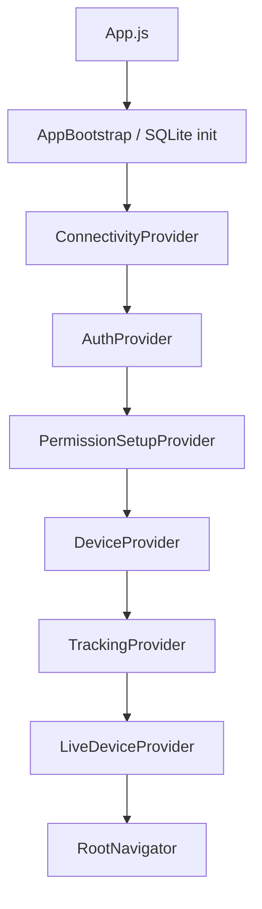
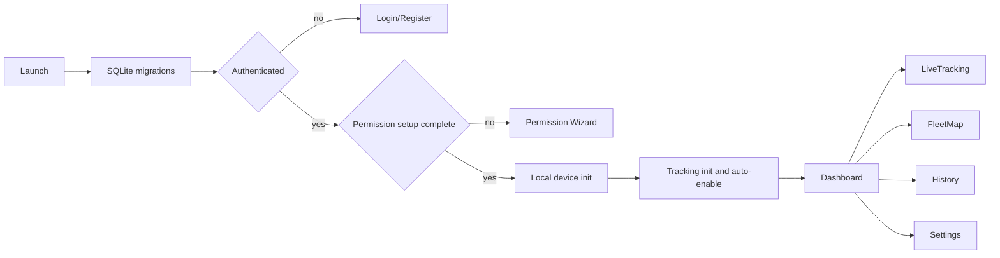
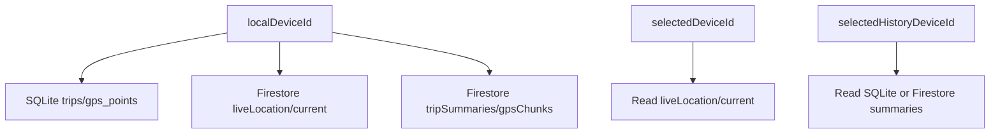
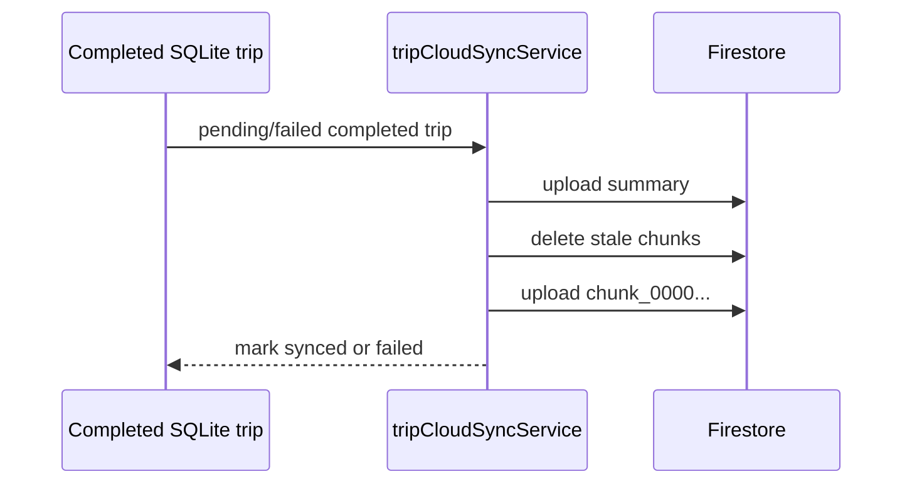

# Track Device Project Export

This document is a source-aligned export of the current Track Device repository.

## 1. Project Overview

| Item | Current State |
| --- | --- |
| Product name | Track Device |
| Version | `1.0.0` in `package.json` and `app.json` |
| Expo SDK | `~54.0.0` |
| React Native | `0.81.5` |
| Primary platform | Android-first, iOS configured |
| Auth | Firebase Email/Password |
| Local database | Expo SQLite |
| Cloud database | Cloud Firestore |
| Maps | `react-native-maps` |
| Location | `expo-location` |
| Background primitive | `expo-task-manager` |

Track Device records GPS trips automatically for the local physical device and lets a Firebase account view multiple devices, realtime live location, local/cloud history, and route playback.

## 2. Architecture



Layers:

- Screens render UI.
- Contexts own global runtime state.
- Services own Firebase, tracking, location, device setup, network, and cache logic.
- Repositories own SQLite SQL.
- Components provide shared UI, branding, icons, map markers, and password modal.

## 3. Application Flow



## 4. Authentication

Implemented:

- register with email/password/confirm password;
- login with email/password;
- logout;
- password change with reauthentication;
- Firestore user profile initialization;
- display-name update.

Not implemented: email verification gate, OTP, Google Sign-In, OAuth, phone auth.

## 5. Permission System

Android setup includes foreground location, background location readiness, notification permission, Auto Start guidance, and battery optimization guidance. iOS setup includes foreground location, always-location prompt, notification guidance, and background limitation text.

Expo Go is not treated as acceptance for Android foreground-service notification or durable background tracking.

## 6. Tracking Engine

`TrackingEngine` owns automatic trip detection. It receives GPS points from `GpsEngine`, normalizes timestamps, calculates coordinate-based speed, filters invalid/spike points, creates active trips, stores accepted GPS points in SQLite, publishes Firestore live location, and completes trips after Parking.

Constants:

- GPS interval: 1000 ms.
- Paused threshold: 30 seconds.
- Parking threshold: 3 minutes.
- Single-point spike threshold: 500 km/h.
- Chunk size for cloud playback: 150 GPS points.

## 7. SQLite

Tables:

- `trips`
- `gps_points`
- `schema_migrations`

SQLite is the local source of truth for local history and playback.

## 8. Firestore

Paths:

```text
users/{uid}
users/{uid}/devices/{deviceId}
users/{uid}/devices/{deviceId}/liveLocation/current
users/{uid}/devices/{deviceId}/tripSummaries/{tripId}
users/{uid}/devices/{deviceId}/tripSummaries/{tripId}/gpsChunks/{chunkId}
users/{uid}/securityLogs/{logId}
```

`liveLocation/current` is realtime-only. Completed trips upload summaries and chunked GPS points.

## 9. Caching

AsyncStorage stores:

- local device ID;
- selected live device;
- selected history device;
- permission setup completion;
- cached devices;
- cached live-location display snapshots.

Cache is display-only and not authoritative trip storage.

## 10. Dashboard

Dashboard shows account/device overview, counts, selected-device metrics, mini map, offline map empty state, and navigation cards.

## 11. Fleet Map

Fleet Map renders account devices with valid coordinates, code-drawn markers, selected-device panel, offline state, listener error state, and a fit-all button.

## 12. Live Tracking

Live Tracking shows local or remote selected-device status, speed, max speed, stopped duration, today distance, coordinates, last update, source label, and local-only active trip ID when applicable.

## 13. History

History supports local SQLite source and remote Firestore source. It groups by date, shows daily summary, trip cards, and local sync controls.

## 14. Playback

Playback supports local SQLite points and remote Firestore chunks. It draws route polylines, moving marker, endpoint markers, progress, seek, and speed controls.

## 15. Notification

Android native builds can show a foreground-service location notification through Expo Location. It is local-device only. iOS has no equivalent implementation. Direct notification tap routing is not implemented.

## 16. Offline Strategy

Firestore/network failure does not stop local SQLite tracking. Cached live snapshots keep display data available. Pending completed trips retry manually or after reconnect.

## 17. Device Management

The app distinguishes:

- `localDeviceId`: physical device recording GPS;
- `selectedDeviceId`: device being viewed in Dashboard/Live Tracking;
- `selectedHistoryDeviceId`: device whose history is viewed.

Device management includes rename, marker preferences, soft delete, app-level session revocation, and security logs.

## 18. UI Design

The design uses a light theme, Track Device branding, custom PNG icons, illustrations, and code-drawn markers. External icon packages are not used.

## 19. Known Limitations

- Durable background GPS persistence is partial.
- Device kick/logout-all is not Admin SDK token revocation.
- Auto Start cannot be verified automatically.
- Battery optimization requires native-build verification.
- Google Maps key is currently in `app.json`.
- Runtime acceptance has not been completed in this environment because Node/Expo runtime execution is unavailable.

## 20. Future Roadmap

- Android native runtime acceptance.
- Durable background tracking context restoration.
- Backend security and token revocation.
- Production secret management.
- Geofence and speed alerts.
- Fleet analytics and rental workflows.

## 21. File Reference

Important files:

- `App.js`: provider composition and setup gate.
- `src/navigation/*`: auth/main navigation.
- `src/contexts/*`: auth, connectivity, permission, device, tracking, live device.
- `src/services/tracking/TrackingEngine.js`: automatic tracking core.
- `src/services/location/GpsEngine.js`: Expo Location adapter.
- `src/services/location/locationTaskService.js`: TaskManager foreground-service task.
- `src/services/firebase/*`: Firebase Auth and Firestore services.
- `src/database/*`: SQLite initialization, migrations, repositories.
- `src/screens/*`: user-facing screens.
- `src/components/*`: shared UI, branding, icons, map markers.
- `src/utils/*`: timestamp, format, geospatial helpers.

## 22. Appendix Diagrams

### Data Ownership



### Sync Flow


