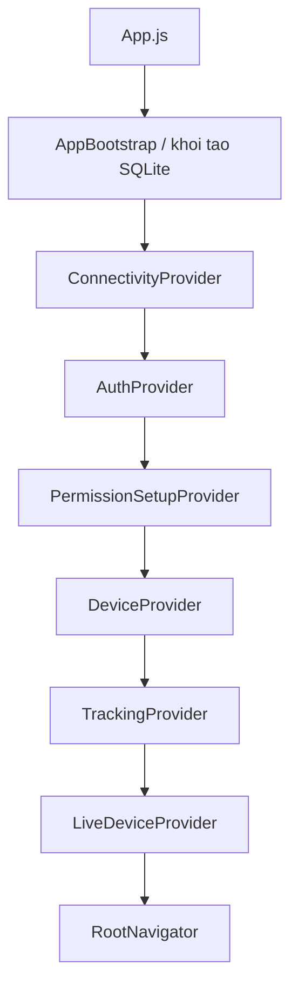
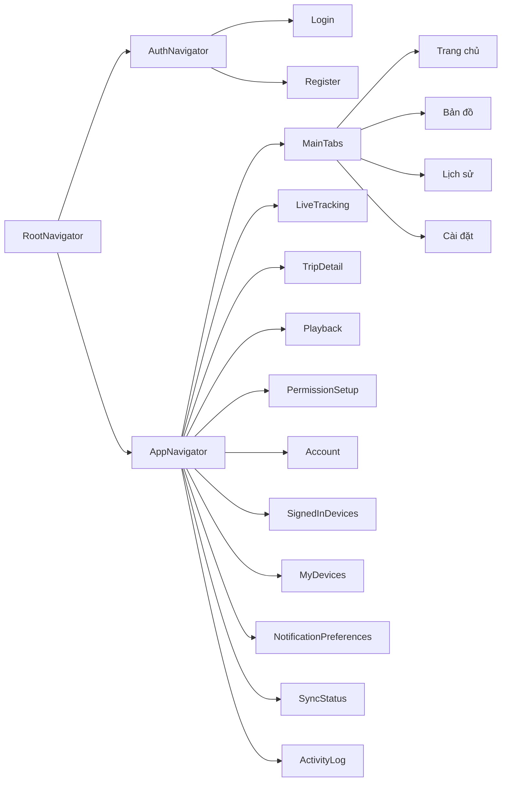
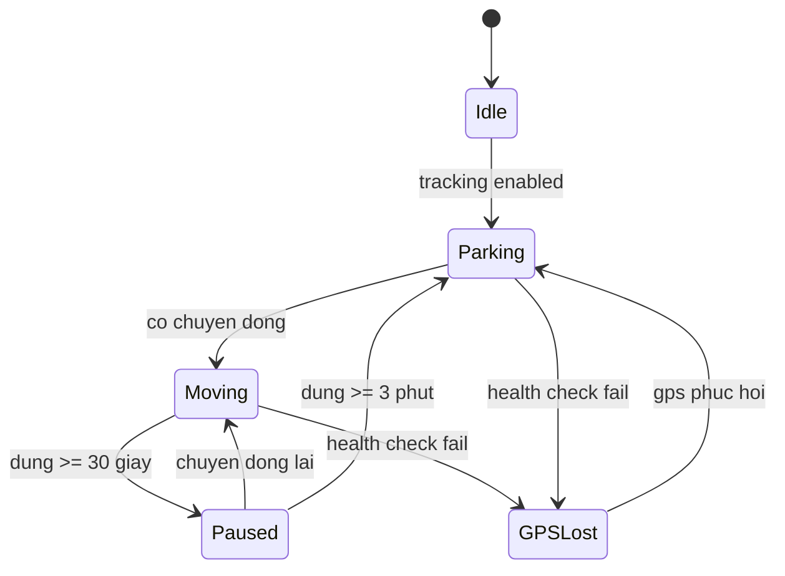
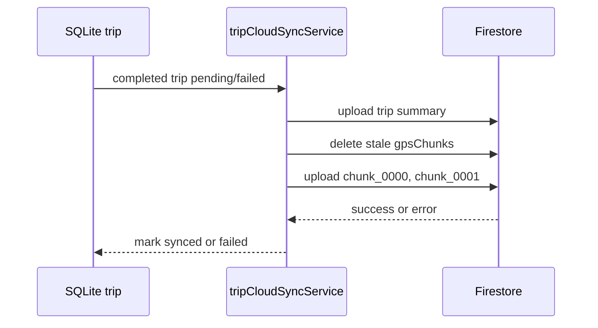

# Tài Liệu Kỹ Thuật Track Device

Tài liệu này mô tả trạng thái source code hiện tại của dự án Track Device. Nội dung được viết cho người cần hiểu kiến trúc, dữ liệu, luồng xử lý và giới hạn hiện tại của ứng dụng mà không cần mở từng file source.

## 1. Tổng Quan

| Mục | Trạng thái hiện tại |
| --- | --- |
| Tên sản phẩm | Track Device |
| Phiên bản | `1.0.0` trong `package.json` và `app.json` |
| Expo SDK | `~54.0.0` |
| React Native | `0.81.5` |
| Nền tảng chính | Android-first, có cấu hình iOS |
| Xác thực | Firebase Email/Password |
| Database cục bộ | Expo SQLite |
| Database đám mây | Cloud Firestore |
| Bản đồ | `react-native-maps` |
| Vị trí | `expo-location` |
| Tác vụ nền | `expo-task-manager` |
| Cache | AsyncStorage |
| Đích phân phối hiện tại | APK Android cài trực tiếp từ EAS profile `production-apk` |

Track Device là ứng dụng theo dõi vị trí nhiều thiết bị trong cùng một tài khoản Firebase. Thiết bị cục bộ tự ghi GPS, tạo chuyến, lưu SQLite, cập nhật vị trí live lên Firestore và đồng bộ chuyến đã hoàn thành lên cloud. Thiết bị khác cùng tài khoản có thể xem vị trí live, lịch sử đã đồng bộ và playback từ dữ liệu cloud.

## 2. Kiến Trúc



Ứng dụng được chia thành các lớp:

| Lớp | Vai trò |
| --- | --- |
| Screens | Hiển thị giao diện và gọi context/service qua API có sẵn |
| Contexts | Quản lý trạng thái runtime toàn cục |
| Services | Xử lý Firebase, tracking, location, cache, network và thiết bị |
| Repositories | Đóng gói SQL cho SQLite |
| Components | UI dùng chung, icon, branding, marker và form |
| Utils | Định dạng, timestamp, tính khoảng cách và tốc độ |
| Constants | Route, tracking, history và cấu hình dùng chung |

Nguyên tắc quan trọng:

- `GpsEngine` chỉ là adapter của Expo Location, không ghi SQLite và không gọi Firebase.
- `TrackingEngine` sở hữu logic tracking, trạng thái di chuyển và vòng đời chuyến.
- SQLite là nguồn chính cho lịch sử và playback của thiết bị hiện tại.
- Firestore live location là dữ liệu realtime, không phải kho lưu toàn bộ route.
- Firestore trip history là read model đồng bộ từ các chuyến đã hoàn thành.

## 3. Navigation



Luồng chính:

1. App khởi động và chạy migration SQLite.
2. Firebase Auth kiểm tra phiên đăng nhập.
3. Nếu chưa đăng nhập, hiển thị Login/Register.
4. Nếu đã đăng nhập, PermissionSetupProvider kiểm tra thiết lập.
5. Nếu setup chưa hoàn tất, hiển thị Permission Wizard.
6. Nếu setup đã sẵn sàng, khởi tạo DeviceProvider, TrackingProvider và LiveDeviceProvider.
7. Người dùng vào Bottom Tab Navigation với bốn tab: Trang chủ, Bản đồ, Lịch sử và Cài đặt.

## 4. Provider

Provider tree hiện tại:

```text
SafeAreaProvider
  AppBootstrap
    ConnectivityProvider
      AuthProvider
        PermissionSetupProvider
          DeviceProvider
            TrackingProvider
              LiveDeviceProvider
                RootNavigator
```

Vai trò từng provider:

| Provider | Trách nhiệm |
| --- | --- |
| AppBootstrap | Khởi tạo SQLite và migration |
| ConnectivityProvider | Theo dõi trạng thái mạng online, offline, checking |
| AuthProvider | Firebase Auth, profile người dùng, đổi mật khẩu, đăng xuất |
| PermissionSetupProvider | Trạng thái wizard, quyền vị trí, thông báo, thiết lập Android/iOS |
| DeviceProvider | Thiết bị cục bộ, danh sách thiết bị, selectedDeviceId |
| TrackingProvider | Khởi tạo và điều phối TrackingEngine cho localDeviceId |
| LiveDeviceProvider | Đọc live-location của thiết bị được chọn và fleet |

`selectedDeviceId` và `selectedHistoryDeviceId` không được dùng để quyết định ownership ghi GPS. Ghi GPS luôn thuộc `localDeviceId`.

## 5. Firebase

Các nhóm Firebase đang dùng:

- Firebase Auth cho đăng ký, đăng nhập, đăng xuất và đổi mật khẩu.
- Firestore user document.
- Firestore devices.
- Firestore liveLocation/current.
- Firestore tripSummaries và gpsChunks.
- Firestore security logs.

Đường dẫn chính:

```text
users/{uid}
users/{uid}/devices/{deviceId}
users/{uid}/devices/{deviceId}/liveLocation/current
users/{uid}/devices/{deviceId}/tripSummaries/{tripId}
users/{uid}/devices/{deviceId}/tripSummaries/{tripId}/gpsChunks/{chunkId}
users/{uid}/securityLogs/{logId}
```

Ví dụ live location:

```json
{
  "deviceId": "local-device-id",
  "latitude": 10.123456,
  "longitude": 106.123456,
  "currentSpeedKmh": 27,
  "maxSpeedKmh": 58,
  "movementStatus": "Moving",
  "connectionStatus": "Online",
  "updatedAt": 1710000000000
}
```

Firestore không lưu mỗi điểm GPS thành một document riêng. Route playback từ cloud dùng chunk, mỗi chunk chứa nhiều điểm.

## 6. SQLite

SQLite lưu lịch sử local của thiết bị hiện tại.

### Bảng `trips`

Các trường chính:

| Trường | Ý nghĩa |
| --- | --- |
| id | ID chuyến |
| date | Ngày chuyến |
| startTime | Thời điểm bắt đầu |
| endTime | Thời điểm kết thúc |
| durationMs | Thời lượng |
| totalDistanceKm | Quãng đường |
| avgSpeedKmh | Tốc độ trung bình |
| maxSpeedKmh | Tốc độ tối đa |
| startLatitude, startLongitude | Tọa độ đầu |
| endLatitude, endLongitude | Tọa độ cuối |
| startAddress, endAddress | Địa chỉ nếu có |
| status | active, completed, interrupted |
| cloudSyncStatus | pending, syncing, synced, failed |
| cloudSyncedAt | Thời điểm đồng bộ thành công |
| cloudSyncError | Lỗi đồng bộ gần nhất |
| cloudSyncAttempts | Số lần thử đồng bộ |

### Bảng `gps_points`

Các trường chính:

| Trường | Ý nghĩa |
| --- | --- |
| id | ID điểm GPS |
| tripId | Chuyến liên quan |
| latitude, longitude | Tọa độ |
| speedKmh | Tốc độ đã tính và đã lọc |
| heading | Hướng di chuyển |
| accuracy | Độ chính xác |
| altitude | Độ cao |
| timestamp | Timestamp epoch milliseconds |
| createdAt | Thời điểm ghi |

### Bảng `schema_migrations`

Dùng để đảm bảo migration chỉ chạy một lần.

SQLite là nguồn chính cho local History và local Playback. Firestore không thay thế SQLite.

## 7. Tracking Engine

`TrackingEngine` là lõi tracking. Nó nhận location từ `GpsEngine`, chuẩn hóa dữ liệu, kiểm tra hợp lệ, tính tốc độ, phát hiện chuyển động và quản lý vòng đời chuyến.



Hằng số đáng chú ý:

| Hằng số | Giá trị |
| --- | --- |
| GPS interval | 1000 ms |
| Paused threshold | 30 giây |
| Parking threshold | 3 phút |
| Single-point spike threshold | 500 km/h |
| Fallback speed guard | 320 km/h |
| Fallback acceleration guard | 45 km/h mỗi giây |
| Speed median window | 3 mẫu |
| GPS chunk size | 150 điểm |

Nguồn tốc độ ưu tiên là `location.coords.speed` của GNSS. Expo trả giá trị này theo m/s, do đó processor đổi sang km/h đúng một lần:

```text
nativeSpeedKmh = coords.speed * 3.6
```

Khi native speed thiếu, âm hoặc không hợp lệ, processor dùng fallback:

```text
speedKmh = distanceKm / (elapsedTimeMs / 3600000)
```

Khoảng cách fallback dùng Haversine từ hai tọa độ liên tiếp. Median ba mẫu giảm nhiễu một frame; fallback có tốc độ/gia tốc bất hợp lý hoặc lệch lớn so với native speed bị từ chối. Foreground và background gọi cùng processor nên UI, SQLite, Firestore và notification không có công thức riêng.

## 8. Fleet Map

Fleet Map hiển thị các thiết bị trong cùng tài khoản có tọa độ hợp lệ.

Tính năng hiện có:

- Subscribe danh sách thiết bị.
- Subscribe live location của từng thiết bị.
- Không render Google Map khi offline.
- Marker tự vẽ, không dùng native pin.
- Màu base marker lấy từ `users/{uid}/devices/{deviceId}.markerColor`; selected ring, local/remote badge và dấu mất kết nối vẫn dùng decoration riêng.
- Chọn marker để xem panel thông tin.
- Nút hiển thị tất cả thiết bị.
- Xử lý thiết bị không có tọa độ, dữ liệu stale hoặc lỗi listener.

Panel thiết bị hiển thị:

- Tên thiết bị.
- Thiết bị này hoặc thiết bị từ xa.
- Trạng thái kết nối.
- Trạng thái di chuyển.
- Tốc độ hiện tại hoặc gần nhất.
- Tốc độ tối đa.
- Thời gian dừng.
- Quãng đường hôm nay nếu có.
- Thời gian cập nhật.
- Tọa độ.
- Nguồn dữ liệu.

## 9. History

History hỗ trợ hai nguồn dữ liệu:

| Nguồn | Cách đọc |
| --- | --- |
| Thiết bị hiện tại | SQLite |
| Thiết bị từ xa | Firestore trip summaries |

`selectedHistoryDeviceId` độc lập với `selectedDeviceId`. Việc chọn thiết bị trong History không thay đổi thiết bị đang xem ở Live Tracking.

Local History:

- Nhóm chuyến theo ngày.
- Tính daily summary từ SQLite.
- Hiển thị trạng thái đồng bộ.
- Cho phép đồng bộ thủ công các chuyến đang chờ.

Remote History:

- Đọc summary từ Firestore.
- Không tải GPS chunks trong danh sách.
- Chỉ tải chunks khi mở Playback.

## 10. Playback

Playback dùng cùng một màn hình cho local và cloud.

Local playback:

- Đọc trip và gps_points từ SQLite.
- Không cần đồng bộ cloud.
- Hoạt động với chuyến đang chờ đồng bộ nếu có điểm GPS local hợp lệ.

Cloud playback:

- Đọc trip summary từ Firestore.
- Đọc gpsChunks theo `chunkIndex`.
- Gộp, sắp xếp, lọc điểm không hợp lệ.
- Loại timestamp trùng trước khi nội suy để tránh đoạn playback có thời lượng bằng 0.
- Clamp điểm trong khoảng `startTime` đến `endTime`.

Giao diện playback có:

- Polyline toàn tuyến.
- Polyline tiến trình.
- Marker bắt đầu.
- Marker kết thúc.
- Marker vị trí hiện tại tự vẽ.
- Play, tạm dừng, phát lại.
- Về đầu, đến cuối.
- Thanh seek.
- Tốc độ phát.

Panel điều khiển là nơi duy nhất hiển thị tốc độ, thời gian và tọa độ tại điểm hiện tại; màn không lặp thêm một card thông tin giống hệt phía trên controls.

## 11. Thông Báo

Android native build dùng foreground-service notification thông qua Expo Location. Notification chỉ đọc local TrackingEngine/TaskManager state và vẫn cập nhật khi offline.

Khi “Thông báo trực tiếp” bật, nội dung có dạng:

```text
Track Device · {tên thiết bị}
{tốc độ} km/h · {trạng thái di chuyển}
{quãng đường} · {thời gian} · {trạng thái online/offline}
```

Khi mất kết nối hoặc mất GPS, dòng tốc độ dùng “Tốc độ gần nhất”. Khi preference tắt, Android vẫn hiển thị nội dung tối thiểu bắt buộc: “Track Device / Theo dõi vị trí đang hoạt động”. Preference này không tắt GPS, SQLite hoặc sync.

```text
Track Device · {tên thiết bị}
Tốc độ gần nhất {tốc độ} km/h · {trạng thái di chuyển}
{quãng đường} · {thời gian} · Đang lưu ngoại tuyến
```

Giới hạn hiện tại:

- Không phải push notification.
- iOS không có notification cố định tương đương Android foreground service.
- Tap notification chủ yếu mở app theo hành vi nền tảng; điều hướng trực tiếp đến Live Tracking chưa được triển khai.
- Expo Go không đủ để xác nhận foreground-service notification; Android runtime evidence phải đến từ Development Build hoặc APK.
- Plugin `expo-location` 19.0.8 cài trong repository không khai báo `androidForegroundServiceIcon`; property hiện có trong app config không chứng minh status-bar icon đã được áp dụng. Cần kiểm tra APK production cuối cùng.

## 12. Offline

Chiến lược offline:

- Tracking local vẫn ghi SQLite nếu GPS hoạt động.
- Android runtime đã xác nhận tracking nền/khóa màn hình vẫn ghi SQLite khi offline.
- Firestore lỗi không làm mất chuyến.
- Dashboard và Live Tracking dùng cache live snapshot gần nhất.
- Fleet Map không render MapView khi offline để tránh lỗi bản đồ.
- History local vẫn đọc được từ SQLite.
- Playback local không cần Internet.
- Chuyến hoàn thành chưa đồng bộ giữ trạng thái pending hoặc failed.

AsyncStorage chỉ là cache hiển thị, không phải nguồn dữ liệu chuyến.

## 13. Sync

Luồng sync:



Quy tắc:

- Chỉ thiết bị cục bộ upload chuyến của chính nó.
- Không upload active trip như completed history.
- Không upload tail xác nhận Parking ngoài `endTime`.
- Nếu upload lỗi, SQLite vẫn giữ dữ liệu.
- Manual sync và auto retry dùng guard để tránh chạy trùng batch.

## 14. Permission

Permission Wizard có luồng riêng cho Android và iOS.

Android:

- Vị trí khi dùng ứng dụng.
- Vị trí luôn cho phép.
- Tự khởi động.
- Tối ưu pin.
- Thông báo.
- Hoàn tất.

iOS:

- Vị trí khi dùng ứng dụng.
- Vị trí luôn luôn.
- Thông báo.
- Hướng dẫn chạy nền.
- Hoàn tất.

App phân biệt trạng thái thực tế và việc người dùng chỉ mở trang cài đặt. Auto Start là trạng thái thủ công vì Android không có API xác minh chung.

## 15. Device

Ba khái niệm thiết bị:

| Khái niệm | Ý nghĩa |
| --- | --- |
| `localDeviceId` | Thiết bị vật lý đang chạy app và ghi GPS |
| `selectedDeviceId` | Thiết bị đang được xem trong Dashboard/Live Tracking |
| `selectedHistoryDeviceId` | Thiết bị đang được xem lịch sử |

DeviceContext quản lý:

- Đăng ký thiết bị cục bộ.
- Tên thiết bị.
- Platform ổn định `ios` hoặc `android`.
- Danh sách thiết bị.
- Thiết bị được chọn.
- Đổi tên.
- Đổi màu trên bản đồ cho thiết bị trên bản đồ trực tiếp.
- Xóa thiết bị qua flow chọn thiết bị riêng và xác thực lại mật khẩu.

Không tự động đổi tên thiết bị từ xa.

## 16. Tài Khoản

Các màn hình tài khoản đang có:

- Account Center cho tài khoản và thiết bị.
- Đổi mật khẩu ở màn riêng.
- Thiết bị đang đăng nhập ở chế độ chỉ đọc.
- Đăng xuất một thiết bị qua flow chọn phiên riêng.
- Quản lý thiết bị của tôi chỉ để đổi tên và đổi màu trên bản đồ.
- Xóa thiết bị qua flow chọn thiết bị riêng.
- Tuỳ chọn thông báo.
- Trạng thái đồng bộ.
- Nhật ký bảo mật.
- Xóa tài khoản ở màn riêng với password reauthentication và xác nhận cuối.

Các thao tác nguy hiểm như đổi mật khẩu, đăng xuất một thiết bị, xóa thiết bị hoặc đăng xuất tất cả yêu cầu nhập lại mật khẩu. Do chưa có backend Admin SDK, các thao tác phiên thiết bị hiện là cơ chế app-level qua Firestore, không phải thu hồi Firebase refresh token toàn cục.

## 17. UI

UI dùng light theme, spacing thống nhất, card bo góc và hệ icon riêng của Track Device. Dự án không dùng icon package bên ngoài. Emoji không dùng làm icon UI.

Màn hình Thiết bị của tôi cho đổi màu marker bằng color picker tự xây: vùng Saturation/Brightness, thanh Hue, preview, nhập HEX, preset nhanh, Hủy và Xong. Màu chỉ được lưu thật khi người dùng bấm Lưu thiết bị. App không cho đổi kiểu icon marker và không áp dụng màu này cho marker Playback, marker bắt đầu/kết thúc hoặc route polyline.

Màn hình chính:

- Login.
- Register.
- Permission Wizard.
- Dashboard.
- Bottom Tab Navigation.
- Live Tracking.
- Fleet Map.
- History.
- Trip Detail.
- Playback.
- Settings.
- Màn hình tài khoản và bảo mật.

## 18. Hiệu Năng

Các điểm tối ưu hiện có:

- Không truy vấn SQLite mỗi frame playback.
- Playback load dữ liệu một lần theo trip.
- Firestore live listeners được cleanup khi unmount hoặc đổi device set.
- Fleet Map không tự fit camera trên mỗi update realtime.
- Cache write là best-effort.
- Sync có guard để hạn chế batch trùng.
- Marker dùng component tự vẽ thay vì native pin.

## 19. Giới Hạn Hiện Tại

- Android background tracking, lock-screen tracking, offline SQLite recording, app-restart recovery, reconnect sync và foreground notification update đã được runtime-verified trên thiết bị Android thật.
- Force-stop dừng background execution cho đến khi app mở lại; swipe-away có thể khác nhau theo Android OEM.
- Chưa có backend Admin SDK để thu hồi token thật sự.
- Chưa có Cloud Functions.
- Auto Start không thể xác minh tự động trên mọi Android vendor.
- Kiểm tra tối ưu pin cần native build và thiết bị thật.
- Google Maps Android key được inject lúc build bằng `app.config.js` từ biến môi trường `GOOGLE_MAPS_ANDROID_API_KEY`; key thật không được commit. Dynamic config dừng sớm với lỗi rõ ràng nếu biến này thiếu, tránh tạo APK không có Maps manifest key.
- Chưa có bộ screenshot runtime chính thức.
- Long-running Android soak test trên nhiều OEM vẫn cần thực hiện.
- Bộ xử lý tốc độ GNSS/Haversine mới chưa được runtime acceptance lại trên xe thật; tốc độ lịch sử ghi trước bản sửa có thể còn sai.
- Repository có draft `firestore.rules`, Privacy Policy, tài liệu xóa tài khoản và checklist APK Android. Rules chưa được Emulator-test/deploy; thông tin đơn vị vận hành, liên hệ và ngày hiệu lực của tài liệu privacy vẫn cần hoàn thiện trước khi phân phối rộng.
- iOS location background pipeline chỉ có code/static configuration. Physical-device background acceptance, iOS distribution, Live Activity và Dynamic Island nằm ngoài phạm vi APK Android hiện tại và không phải release blocker.
- Môi trường local hiện phải có `GOOGLE_MAPS_ANDROID_API_KEY` mới resolve được Expo config; manifest Android đã sinh trước đó không chứng minh key mới đã được inject.

### Runtime Acceptance Checklist

- Không có duplicate GPS points khi chuyển foreground/background.
- Không có duplicate active trips khi TaskManager và foreground runtime cùng tồn tại.
- Không có duplicate cloud trip summaries hoặc GPS chunks sau reconnect.
- Foreground/background transition giữ đúng active trip.
- Lock-screen tracking tiếp tục ghi SQLite và cập nhật foreground notification.
- Offline restart/recording tiếp tục lưu local GPS nếu GPS hoạt động.
- Reconnect sync đẩy pending local trips lên Firestore.
- Logout cleanup dừng task, notification và persisted tracking state.
- Tracking disable cleanup dừng task và không ghi thêm GPS point.
- Long-running battery/memory behavior cần soak test trên nhiều Android OEM.

## 20. Roadmap

Các hướng phát triển hợp lý tiếp theo:

- Soak test Android dài hạn cho duplicate points/trips/cloud chunks, pin và bộ nhớ.
- Road-test bộ xử lý tốc độ GNSS/Haversine với đồng hồ xe và các điều kiện GPS khác nhau.
- Runtime-test preference notification đầy đủ/tối thiểu trên APK production.
- Build, cài trực tiếp và chạy checklist acceptance cho EAS profile `production-apk`.
- Backend bảo mật cho session và thiết bị.
- Kiểm thử/deploy Firestore Security Rules; bổ sung App Check và CI/emulator tests.
- Quản lý secret production.
- Geofence.
- Cảnh báo tốc độ.
- Thống kê đội thiết bị.
- Web dashboard.
- Workflow quản lý xe thuê hoặc tài sản di động.

## 21. Cấu Trúc Thư Mục

```text
src/
  assets/
    branding/
    icons/
    illustrations/
  components/
    branding/
    icons/
    map/
    security/
    ui/
  constants/
  contexts/
  database/
    migrations/
    repositories/
  hooks/
  navigation/
  screens/
    account/
    auth/
    history/
    main/
    settings/
    setup/
    tracking/
  services/
    cache/
    device/
    firebase/
    location/
    network/
    tracking/
  theme/
  types/
  utils/
```

File quan trọng:

| File | Vai trò |
| --- | --- |
| `App.js` | Provider composition và setup gate |
| `src/navigation/*` | AuthNavigator, AppNavigator, RootNavigator |
| `src/contexts/*` | State toàn cục |
| `src/services/tracking/TrackingEngine.js` | Lõi tracking |
| `src/services/tracking/speedProcessor.js` | Chuẩn hóa GNSS speed, Haversine fallback và lọc spike |
| `src/services/location/GpsEngine.js` | Adapter Expo Location |
| `src/services/location/locationTaskService.js` | TaskManager task |
| `src/services/firebase/*` | Firebase Auth và Firestore |
| `src/database/*` | SQLite init, migration, repository |
| `src/screens/*` | Giao diện người dùng |
| `src/components/*` | UI dùng chung |
| `src/utils/*` | Format, timestamp, geo |

## 22. Kết Luận

Track Device hiện là một ứng dụng GPS tracking local-first có auth, quản lý/xóa tài khoản, thiết bị, tracking, SQLite, Firestore, Fleet Map, History, Playback, cache offline, permission setup và account/security UI. Android runtime đã xác nhận tracking nền, lock-screen tracking, offline recording, khôi phục sau khi mở lại app, reconnect sync và foreground notification update. Đích phân phối hiện tại là APK Android cài trực tiếp, không phải cửa hàng ứng dụng. Trước acceptance cuối cần build/cài profile `production-apk`, road-test tốc độ, kiểm tra rich/minimal notification, chạy soak test đa OEM, xác minh Maps manifest và kiểm thử/deploy Firestore Rules. iOS chỉ là static compatibility và không nằm trong điểm hoàn thành release hiện tại.
