# Track Device Project Export

Self-contained project documentation generated from the current repository state.

Generated for Sprint 21. This document describes the Track Device codebase without requiring the reader to open source files. It covers product scope, runtime architecture, data storage, navigation, screens, synchronization, permissions, offline behavior, notification behavior, known limitations, and file references.

---

## 1. Project Overview

### 1.1 Project Name

Track Device

### 1.2 Version

Application version: `1.0.0`

MVP stage: MVP 1

Package metadata still uses legacy technical identifiers:

| Identifier | Current value | Notes |
| --- | --- | --- |
| `package.json` name | `trackcam` | Preserved for compatibility. |
| Expo slug | `trackcam` | Preserved to avoid project identity breakage. |
| Android package | `com.danghieu.trackcam` | Preserved. |
| SQLite database filename | `trackcam.db` | Preserved. |
| AsyncStorage keys | `trackcam.*` | Preserved. |
| User-visible product name | `Track Device` | Current branding. |

### 1.3 Purpose

Track Device is a React Native Expo application that turns a mobile device into an automatic GPS tracking device. The app records GPS points locally, detects trips automatically from movement, displays live device status, syncs completed trip history to Firestore, and allows multiple devices under the same Firebase account to be monitored.

The product is not a dashcam. MVP 1 does not include camera, video, FFmpeg, AI, driver scoring, or media storage.

### 1.4 Main Objectives

Track Device MVP 1 aims to:

1. Authenticate users with Firebase Email/Password Authentication.
2. Create or restore a stable local device identity.
3. Start automatic foreground GPS tracking when setup is complete and tracking is enabled.
4. Detect Moving, Paused, Parking, GPS Lost, Online, and Offline conditions.
5. Create trips automatically when meaningful movement begins.
6. Complete trips automatically after parking is confirmed.
7. Store accepted GPS points in SQLite as the local source of truth.
8. Publish latest live location to Firestore when online.
9. Preserve last-known display data when the network is unavailable.
10. Synchronize completed local trips to Firestore summaries plus GPS chunks.
11. Allow local and remote trip history viewing.
12. Support local and cloud playback on a map.
13. Show all account devices on Fleet Map.
14. Provide a platform-specific permission setup wizard.
15. Provide an Android foreground-service tracking notification in Development Build/APK contexts.

### 1.5 Technologies

| Area | Technology |
| --- | --- |
| App framework | React Native |
| Runtime/build | Expo SDK 54 |
| React | React 19.1 |
| React Native | React Native 0.81.5 |
| Auth | Firebase Authentication |
| Cloud database | Cloud Firestore |
| Local database | Expo SQLite |
| Maps | react-native-maps |
| Location | expo-location |
| Background task primitive | expo-task-manager |
| Device metadata | expo-device |
| Local key-value storage | AsyncStorage |
| Navigation | React Navigation Native Stack |
| Safe areas | react-native-safe-area-context |

### 1.6 Target Platform

The product is Android-first, but the current repository includes iOS runtime paths and iOS permission copy.

Android is the primary acceptance platform for:

- foreground GPS tracking;
- Android permissions;
- Android foreground-service notification;
- EAS preview APK testing.

iOS support exists for:

- authentication;
- Dashboard, History, Playback, Settings, and Fleet Map UI;
- foreground and always-location permission guidance;
- notification settings guidance.

iOS does not implement Android-style foreground-service notifications.

### 1.7 Development Environment

Prerequisites:

| Requirement | Notes |
| --- | --- |
| Node.js | `>=20` as declared in `package.json`. |
| npm | Used for dependency install. |
| Expo CLI | Used through `npx expo`. |
| Firebase project | Requires Email/Password Authentication and Firestore. |
| Android Studio or Android device | Needed for realistic GPS and permission testing. |
| EAS CLI | Needed for APK builds. |

Common commands:

```bash
npm install
npx expo start
eas build --platform android --profile preview
```

Environment variables are read from Expo public environment variables:

```text
EXPO_PUBLIC_FIREBASE_API_KEY
EXPO_PUBLIC_FIREBASE_AUTH_DOMAIN
EXPO_PUBLIC_FIREBASE_PROJECT_ID
EXPO_PUBLIC_FIREBASE_STORAGE_BUCKET
EXPO_PUBLIC_FIREBASE_MESSAGING_SENDER_ID
EXPO_PUBLIC_FIREBASE_APP_ID
```

`.env.example` contains placeholder values for all required Firebase variables.

### 1.8 Explicit MVP 1 Non-Goals

MVP 1 must not implement:

- camera;
- dashcam;
- video recording;
- FFmpeg;
- AI;
- computer vision;
- driver scoring;
- cloud media storage;
- one Firestore document per GPS point;
- a `daily_tracks` database table;
- manual primary Start Trip / Stop Trip workflow.

---

## 2. Architecture

### 2.1 Architectural Style

Track Device is layered around contexts, services, repositories, and screens.

The intended dependency direction is:

```text
Screen -> Context/Hook -> Service -> Repository/Firebase Service -> External API
```

Screens should not directly perform SQL queries or write Firestore. UI receives data through contexts, hooks, or tracking/history services.

### 2.2 High-Level Architecture Diagram

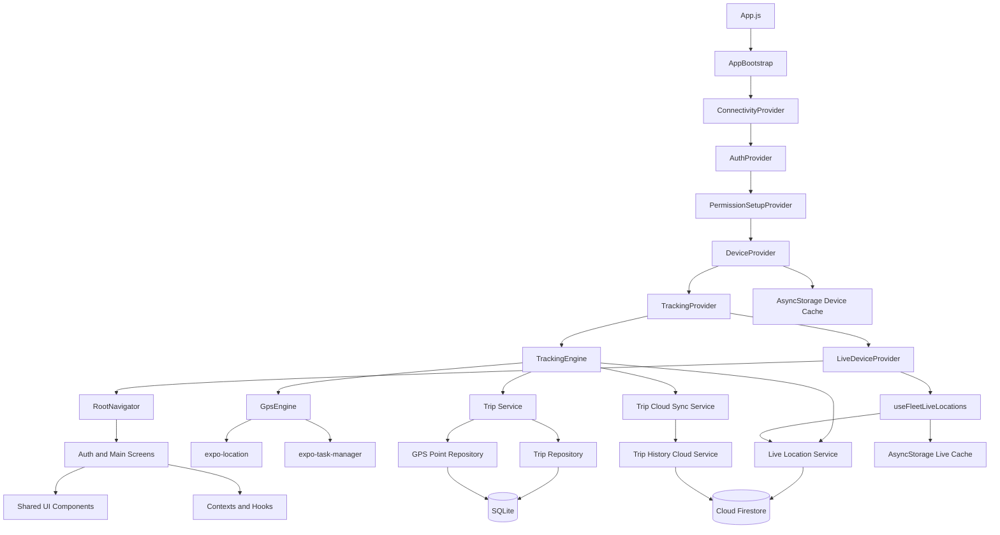

### 2.3 Folder Structure

```text
src/
  assets/
    branding/
    icons/
    illustrations/
  components/
    branding/
    common/
    icons/
    map/
    tracking/
    ui/
  constants/
  contexts/
  database/
    migrations/
    repositories/
  hooks/
  navigation/
  screens/
    auth/
    history/
    main/
    settings/
    setup/
    tracking/
  services/
    cache/
    device/
    firebase/
    location/
    network/
    tracking/
  theme/
  types/
  utils/
```

### 2.4 Application Layers

| Layer | Purpose | Examples |
| --- | --- | --- |
| App bootstrap | Initialize database and top-level providers. | `App.js`, `InitializationContext.js` |
| Contexts | Provide app-wide state and lifecycle orchestration. | `AuthContext`, `DeviceContext`, `TrackingContext` |
| Navigation | Route between auth and main screens. | `RootNavigator`, `AuthNavigator`, `AppNavigator` |
| Screens | Render user-facing UI. | Dashboard, History, Fleet Map, Playback |
| Services | Own domain operations and external SDK integration. | Firebase services, TrackingEngine, GpsEngine |
| Repositories | Own SQLite SQL access. | `tripRepository`, `gpsPointRepository` |
| Hooks | Compose subscriptions for screen-facing data. | `useFleetLiveLocations` |
| Utilities | Shared pure helpers. | formatting, timestamps, geo, IDs |
| Theme/components | Shared visual system. | colors, typography, buttons, cards, icons |

### 2.5 Contexts

| Context | File | Responsibilities |
| --- | --- | --- |
| `AuthContext` | `src/contexts/AuthContext.js` | Subscribes to Firebase auth state, exposes `user`, `loading`, `isAuthenticated`, `login`, `register`, and `logout`, and initializes a user profile idempotently. |
| `InitializationContext` / `AppBootstrap` | `src/contexts/InitializationContext.js` | Initializes SQLite once before rendering app providers. Shows startup loading or startup error state. |
| `ConnectivityContext` | `src/contexts/ConnectivityContext.js` | Provides shared connectivity state: `online`, `offline`, or `checking`. Uses reachability checks, active AppState refresh, and a modest interval. |
| `PermissionSetupContext` | `src/contexts/PermissionSetupContext.js` | Stores first-run setup completion in AsyncStorage and verifies foreground permission before treating setup as complete. |
| `DeviceContext` | `src/contexts/DeviceContext.js` | Owns local device ID, local device name, device list subscription, selected live-view device, device cache, and local device metadata publication. |
| `TrackingContext` | `src/contexts/TrackingContext.js` | Connects authenticated user and local device to `TrackingEngine`, auto-initializes tracking, exposes tracking state and enable/disable controls, and configures notification presentation. |
| `LiveDeviceContext` | `src/contexts/LiveDeviceContext.js` | Provides fleet device live-location snapshots, selected fleet device, online state, and listener errors. |

### 2.6 Services

| Service area | Files | Purpose |
| --- | --- | --- |
| Firebase auth | `authService.js` | Email/password register, login, logout, auth subscription. |
| Firebase config | `firebaseConfig.js` | Initializes Firebase app, Auth with AsyncStorage persistence, and Firestore. |
| Firebase user/device/live location | `userService.js`, `deviceService.js`, `liveLocationService.js` | Firestore profile, device documents, live-location reads/writes/subscriptions. |
| Firebase cloud history | `tripHistoryCloudService.js` | Uploads trip summaries and GPS chunks, lists summaries, loads remote playback. |
| Location | `GpsEngine.js`, `locationPermissionService.js`, `locationTaskService.js` | Foreground GPS watching, permission checks, Android task integration. |
| Tracking | `TrackingEngine.js`, `tripService.js`, `tripStatsService.js`, `historyService.js`, `tripCloudSyncService.js`, `liveTrackingNotificationService.js` | Auto tracking, auto trip lifecycle, stats, history, cloud sync, notification content. |
| Device setup | `deviceIdentityService.js`, `deviceMetadataService.js`, `deviceSetupService.js` | Stable device ID, platform/name detection, Android settings helpers, notification permission. |
| Cache | `liveDataCacheService.js` | AsyncStorage device and live-location display cache. |
| Network | `connectivityService.js` | HTTP reachability check with timeout. |

### 2.7 Repositories

Repositories own SQL and are the only layer that directly manipulates SQLite tables.

| Repository | Purpose |
| --- | --- |
| `tripRepository.js` | Create, update, end, list, delete trips, list dates, list pending sync trips, update cloud sync status. |
| `gpsPointRepository.js` | Insert points, list points by trip, list bounded points by trip/time range, count points, delete points by trip, trim points after trip end. |

### 2.8 Navigation

Navigation uses React Navigation native stack.

```text
AuthNavigator
  Login
  Register

AppNavigator
  Dashboard
  LiveTracking
  FleetMap
  History
  TripDetail
  Playback
  PermissionSetup
  Settings
```

`RootNavigator` chooses `AuthNavigator` or `AppNavigator` based on `AuthContext`.

### 2.9 Shared Components

| Component group | Purpose |
| --- | --- |
| `components/ui` | Cards, buttons, info rows, status badges, headers, empty states. |
| `components/branding` | `BrandMark`, empty-state illustrations. |
| `components/icons` | `TrackIcon` PNG icon wrapper. |
| `components/map` | `DeviceMapMarker`, `MapErrorBoundary`. |
| `components/common` | Placeholder screen support. |

### 2.10 Ownership Rules

Track Device separates three device concepts:

| Concept | Meaning |
| --- | --- |
| `localDeviceId` | The physical device currently running the app. Only this device records local GPS and uploads its completed trips. |
| `selectedDeviceId` | The device currently viewed in Dashboard and Live Tracking. May be local or remote. Must not alter local tracking. |
| `selectedHistoryDeviceId` | The device whose History screen is being viewed. Must not alter local tracking or live-view selection. |

Cloud upload ownership always uses `localDeviceId`.

---

## 3. Application Flow

### 3.1 End-to-End Flow Diagram

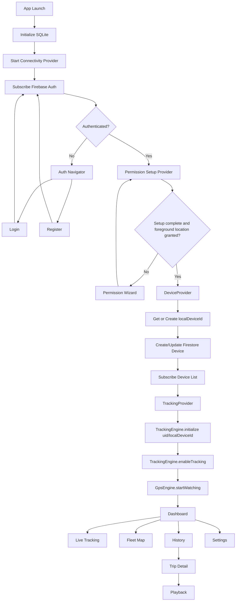

### 3.2 App Launch

`App.js` starts with:

1. `SafeAreaProvider`.
2. `AppBootstrap`, which initializes SQLite and migrations.
3. `ConnectivityProvider`.
4. `AuthProvider`.
5. `AuthenticatedRuntime`.

If SQLite initialization fails, the app shows a startup error state and does not render the rest of the app.

### 3.3 Authentication Transition

`RootNavigator` renders:

- loading screen while auth/profile initialization is pending;
- `AuthNavigator` if unauthenticated;
- `AppNavigator` if authenticated.

There is no email-verification gate, no Google Sign-In, and no OTP flow.

### 3.4 Permission Setup Transition

After authentication, `PermissionSetupProvider` checks:

- saved setup completion key;
- foreground location permission.

If setup is incomplete or foreground location is not granted, `PermissionWizardScreen` is shown. When setup is completed, `DeviceProvider`, `TrackingProvider`, and `LiveDeviceProvider` mount.

### 3.5 Device Registration Transition

`DeviceProvider`:

1. Reads or creates a stable local device ID from AsyncStorage.
2. Loads cached devices for fast offline display.
3. Reads the existing Firestore local device document if possible.
4. Publishes local device metadata to Firestore.
5. Subscribes to all devices under the authenticated user.
6. Restores or selects `selectedDeviceId`.

### 3.6 Tracking Initialization Transition

`TrackingContext` waits for:

- auth loading complete;
- user ID present;
- device loading complete;
- `localDeviceId` present.

Then it calls:

```text
TrackingEngine.initialize({ uid, deviceId: localDeviceId })
TrackingEngine.enableTracking()
```

`initialize()` only prepares state. `enableTracking()` starts GPS watching.

### 3.7 Dashboard Transition

Dashboard is the authenticated landing screen. It shows:

- account branding and user email;
- device counts;
- mini map or offline state;
- selected-device chips;
- speed/status hero;
- quick metrics;
- navigation cards.

Dashboard does not own tracking lifecycle. It reads context state.

### 3.8 History Transition

History owns a separate `selectedHistoryDeviceId` persisted in AsyncStorage. If it equals `localDeviceId`, the screen loads SQLite history. If it points to another device, it loads Firestore trip summaries.

### 3.9 Fleet Map Transition

Fleet Map uses the subscribed device list and live-location snapshots. It renders a map only when connectivity is confirmed online. Offline or unknown connectivity shows a text-first retry state instead of mounting MapView.

### 3.10 Settings Transition

Settings allows:

- local device rename;
- auto tracking enable/disable;
- permission status refresh;
- reopening setup wizard;
- logout.

Settings can disable local tracking, but it does not modify remote devices.

---

## 4. Authentication

### 4.1 Supported Auth Methods

Only Firebase Email/Password Authentication is supported.

Supported:

- register with email/password;
- confirm password during registration;
- login with email/password;
- logout.

Not supported:

- email verification gate;
- resend verification;
- OTP;
- Google Sign-In;
- OAuth provider flow.

### 4.2 Firebase Auth Initialization

`firebaseConfig.js` initializes Auth with React Native AsyncStorage persistence:

```js
initializeAuth(app, {
  persistence: getReactNativePersistence(ReactNativeAsyncStorage),
});
```

If Auth is already initialized during module reload, it safely reuses `getAuth(app)`.

### 4.3 Registration Flow

`RegisterScreen` validates:

| Field | Validation |
| --- | --- |
| Email | Required and basic email regex. |
| Password | Required and at least 6 characters. |
| Confirm password | Required and must exactly match password. |

After validation:

1. Screen calls `useAuth().register(email, password)`.
2. `AuthContext` calls `registerWithEmail`.
3. `authService` calls `createUserWithEmailAndPassword`.
4. `AuthContext` observes the authenticated user.
5. `AuthContext` initializes Firestore profile idempotently.
6. The app proceeds to permission/device/tracking runtime.

### 4.4 Login Flow

`LoginScreen` validates:

- email required;
- password required;
- email format.

After validation:

1. Screen calls `useAuth().login(email, password)`.
2. `authService` calls `signInWithEmailAndPassword`.
3. `AuthContext` observes the authenticated user.
4. `AuthContext` ensures the user profile exists.
5. The app proceeds to setup/device/tracking.

### 4.5 Logout Flow

Settings calls `useAuth().logout()`, which calls Firebase `signOut`.

Effects of logout:

- auth state becomes null;
- `RootNavigator` returns to `AuthNavigator`;
- `DeviceProvider` clears local context state when unmounted or when auth disappears;
- `TrackingContext` shuts down local tracking when user context is removed.

### 4.6 Firestore User Profile

Path:

```text
users/{uid}
```

Fields created by `ensureUserProfile` / `createUserProfile` include:

```js
{
  uid,
  email,
  displayName,
  createdAt,
  updatedAt
}
```

Profile creation is idempotent. Existing profile documents are not overwritten unnecessarily.

---

## 5. Permission System

### 5.1 Permission Principles

The app distinguishes permission readiness from implemented background tracking.

Important truth:

- Foreground location is required for current MVP 1 tracking.
- Background location permission may be requested/prepared.
- Background location permission does not mean durable background tracking is complete.
- Expo Go is not an acceptance environment for background GPS or Android foreground-service notification.

### 5.2 Android Permissions

`app.json` declares:

```text
ACCESS_FINE_LOCATION
ACCESS_COARSE_LOCATION
ACCESS_BACKGROUND_LOCATION
FOREGROUND_SERVICE
FOREGROUND_SERVICE_LOCATION
POST_NOTIFICATIONS
```

Expo Location plugin config:

```json
[
  "expo-location",
  {
    "isAndroidBackgroundLocationEnabled": true,
    "isAndroidForegroundServiceEnabled": true
  }
]
```

Android setup wizard steps:

1. Vị trí khi dùng ứng dụng.
2. Vị trí luôn cho phép.
3. Tự khởi động.
4. Tối ưu pin.
5. Thông báo.
6. Hoàn tất.

### 5.3 iOS Permissions

`app.json` includes:

```text
NSLocationWhenInUseUsageDescription
NSLocationAlwaysAndWhenInUseUsageDescription
```

iOS wizard steps:

1. Vị trí khi dùng ứng dụng.
2. Vị trí luôn luôn.
3. Thông báo.
4. Hướng dẫn chạy nền.
5. Hoàn tất.

iOS does not show Android Auto Start or battery optimization steps.

### 5.4 Permission Wizard

`PermissionWizardScreen` is rendered after auth if setup is incomplete.

It:

- displays Track Device branding;
- shows step progress;
- uses platform-specific step arrays;
- requests foreground permission;
- requests background permission only after foreground permission;
- opens app settings when needed;
- explains Expo Go limitations;
- stores completion through `PermissionSetupContext.completeSetup()`.

Completion is stored in AsyncStorage key:

```text
trackcam.permissionSetup.completed.v1
```

### 5.5 Auto Start

Android Auto Start is a manual, manufacturer-specific setting.

`deviceSetupService.js` checks manufacturer from `Platform.constants` and attempts to open relevant Android settings intents for:

- Xiaomi;
- Huawei;
- Vivo;
- Oppo;
- Realme;
- Samsung;
- generic Android fallback.

The app does not claim Auto Start was enabled because Android has no universal verifiable API for this setting.

### 5.6 Battery Optimization

Android battery optimization settings are opened with:

```text
android.settings.IGNORE_BATTERY_OPTIMIZATION_SETTINGS
```

This is guidance only. The app does not verify that optimization was disabled.

### 5.7 Notification Permission

Android 13+ requires `POST_NOTIFICATIONS`.

`deviceSetupService.js` uses `PermissionsAndroid`:

- Android API < 33: notification permission is treated as not required.
- Android API >= 33: checks and requests `POST_NOTIFICATIONS`.

iOS notification setup is guidance only in this MVP. iOS does not use Android-style persistent foreground-service notification.

### 5.8 Background Location

`locationPermissionService.js` exposes:

- `requestForegroundPermission()`;
- `checkForegroundPermission()`;
- `requestBackgroundPermission()`;
- `checkBackgroundPermission()`;
- `refreshPermissionStatus()`;
- `isLocationServiceEnabled()`.

Background permission is only readiness. Durable background GPS persistence is not accepted yet.

---

## 6. Tracking Engine

### 6.1 Core Responsibility

`TrackingEngine` owns automatic local tracking state:

- initialized user/device context;
- enabled/disabled state;
- movement status;
- connection status;
- active trip ID;
- current speed;
- active trip max speed;
- stopped duration;
- last accepted GPS point;
- parking candidate timing;
- spike-filter pending state;
- Firestore live location publishing;
- completed-trip sync trigger.

### 6.2 TrackingEngine Public API

```js
initialize({ uid, deviceId }, reason)
enableTracking(reason)
disableTracking(reason)
shutdown(reason)
subscribeToState(callback)
getState()
configureTrackingNotification({ deviceName, isNetworkOnline })
```

There is no primary manual `startTracking()` or `stopTracking()` trip API.

### 6.3 GpsEngine

`GpsEngine` is isolated from SQLite and Firebase.

Responsibilities:

- request foreground permission;
- get current location;
- check location health;
- start/stop watching;
- maintain listeners;
- notify listeners with location updates.

Default watch options:

```js
{
  accuracy: Location.Accuracy.Highest,
  timeInterval: 1000,
  distanceInterval: 0
}
```

### 6.4 TaskManager Integration

`locationTaskService.js` defines one top-level task:

```text
track-device-live-location-task
```

On Android Development Build/APK, `GpsEngine` can use `Location.startLocationUpdatesAsync()` with `foregroundService` options.

Current limitation:

- the task forwards locations into an in-memory listener set;
- it does not restore Firebase auth, `localDeviceId`, or active-trip context if React runtime is not mounted;
- it does not write accepted GPS points directly from the task;
- therefore full durable background tracking remains future work.

### 6.5 Movement and Connection Status

Movement status values:

| Internal | Vietnamese label | Meaning |
| --- | --- | --- |
| `Idle` | Không hoạt động | Tracking disabled or missing context. |
| `Moving` | Đang di chuyển | Meaningful movement detected. |
| `Paused` | Tạm dừng | Active trip stopped at least 30 seconds but not yet parked. |
| `Parking` | Đỗ xe | No meaningful movement for 3 minutes. |
| `GPS Lost` | Mất GPS | Permission/services/provider failure or health check failure. |

Connection status values:

| Internal | Vietnamese label | Meaning |
| --- | --- | --- |
| `Online` | Trực tuyến | Live location publish is succeeding or network is available. |
| `Offline` | Mất kết nối | Firestore publish failed or shared connectivity is offline. |

Connection status does not replace movement status.

### 6.6 Tracking Constants

| Constant | Value | Purpose |
| --- | --- | --- |
| `MOVING_SPEED_THRESHOLD_KMH` | `5` | Speed threshold for movement. |
| `MOVING_DISTANCE_THRESHOLD_METERS` | `50` | Distance from parking point to start movement. |
| `PARKING_RADIUS_METERS` | `30` | Radius for parking detection. |
| `TEMPORARY_STOP_DURATION_MS` | `30 * 1000` | Paused threshold. |
| `PARKING_DURATION_MS` | `3 * 60 * 1000` | Parking completion threshold. |
| `GPS_LOST_TIMEOUT_MS` | `30 * 1000` | Heartbeat timeout before health check. |
| `DEFAULT_GPS_INTERVAL_MS` | `1000` | Requested GPS update interval. |
| `REMOTE_DEVICE_OFFLINE_TIMEOUT_MS` | `60 * 1000` | Remote live-location freshness window. |
| `MIN_VALID_POINT_INTERVAL_MS` | `500` | Reject too-fast duplicate points. |
| `MAX_ACCEPTABLE_ACCURACY_METERS` | `80` | Reject poor accuracy when finite. |
| `SINGLE_POINT_SPIKE_SPEED_KMH` | `500` | Suspicious high-speed threshold. |
| `SPIKE_CONFIRMATION_COUNT` | `2` | Samples needed to accept sustained high speed. |
| `MAX_JUMP_DISTANCE_METERS` | `1000` | Teleport jump threshold. |

### 6.7 Speed Calculation

Canonical speed is calculated from coordinates and timestamps:

```text
distanceKm = Haversine(previousAcceptedPoint, currentPoint)
elapsedHours = elapsedTimeMs / 3600000
speedKmh = distanceKm / elapsedHours
```

Rules:

- first point speed is `0`;
- non-increasing timestamps produce speed `0` and are rejected by validation;
- invalid coordinates are rejected;
- high speeds are not capped;
- invalid points are rejected rather than clamped.

### 6.8 GPS Spike Filtering

Rejected points do not:

- update current speed;
- update active trip max speed;
- update previous accepted point;
- enter SQLite;
- affect trip distance;
- affect playback;
- update Firestore liveLocation;
- trigger Moving status.

Rejection reasons include:

- invalid coordinates;
- invalid timestamp;
- poor accuracy;
- non-increasing timestamp;
- interval too short;
- impossible jump;
- pending high-speed confirmation;
- inconsistent high-speed candidate.

### 6.9 Trip Lifecycle

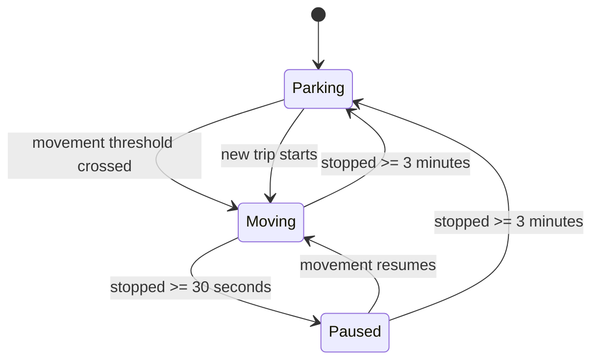

Trip lifecycle:

1. Tracking starts in Parking-like readiness after enablement.
2. Meaningful movement creates an active trip.
3. Accepted GPS points are saved while trip is active.
4. Paused keeps the trip active.
5. Parking completes the trip.
6. Trip `endTime` is the start of the final stationary candidate window, not the later confirmation time.
7. GPS points after completed `endTime` are deleted from the trip.
8. Completed trip is marked `pending` for cloud sync.

### 6.10 Offline Mode and Reconnect

When Firestore live location publish fails, `TrackingEngine` sets connection status to Offline. SQLite storage continues.

When shared connectivity changes back to online:

- `TrackingContext` calls `syncPendingTrips(uid, localDeviceId)`;
- History may refresh if mounted;
- pending or failed completed trips are retried with guards.

### 6.11 Heartbeat and GPS Lost

The engine does not treat stationary silence as GPS Lost immediately. When no callback arrives for `GPS_LOST_TIMEOUT_MS`, it checks location health.

If permission/services are healthy:

- it keeps Parking or current stopped movement state;
- it may request a current location;
- it does not fabricate points.

If health fails:

- movement status becomes GPS Lost.

---

## 7. SQLite

### 7.1 Database Name

SQLite database filename:

```text
trackcam.db
```

The filename is preserved for compatibility even though the product name is Track Device.

### 7.2 Initialization

`AppBootstrap` calls `initDatabase()` before rendering the normal provider tree.

`database.js`:

1. Opens the database with `SQLite.openDatabaseAsync`.
2. Enables foreign keys.
3. Creates `schema_migrations`.
4. Runs migrations in ID order if not already applied.
5. Stores applied migration ID/name/timestamp.

### 7.3 Migrations

| Migration | Purpose |
| --- | --- |
| `001_create_tracking_tables` | Creates `trips`, `gps_points`, indexes. |
| `002_add_trip_location_fields` | Adds start/end coordinate and address fields when missing. |
| `003_add_trip_cloud_sync_fields` | Adds cloud sync fields, defaults completed trips to pending, adds cloud sync index. |

### 7.4 `trips` Table Schema

```sql
CREATE TABLE IF NOT EXISTS trips (
  id TEXT PRIMARY KEY NOT NULL,
  date TEXT NOT NULL,
  startTime INTEGER NOT NULL,
  endTime INTEGER,
  durationMs INTEGER,
  totalDistanceKm REAL NOT NULL DEFAULT 0,
  avgSpeedKmh REAL,
  maxSpeedKmh REAL,
  startLatitude REAL,
  startLongitude REAL,
  endLatitude REAL,
  endLongitude REAL,
  startAddress TEXT,
  endAddress TEXT,
  status TEXT NOT NULL CHECK (status IN ('active', 'completed', 'interrupted')),
  cloudSyncStatus TEXT,
  cloudSyncedAt INTEGER,
  cloudSyncError TEXT,
  cloudSyncAttempts INTEGER NOT NULL DEFAULT 0,
  createdAt INTEGER NOT NULL,
  updatedAt INTEGER NOT NULL
);
```

### 7.5 `gps_points` Table Schema

```sql
CREATE TABLE IF NOT EXISTS gps_points (
  id TEXT PRIMARY KEY NOT NULL,
  tripId TEXT NOT NULL,
  latitude REAL NOT NULL,
  longitude REAL NOT NULL,
  speedKmh REAL,
  heading REAL,
  accuracy REAL,
  altitude REAL,
  timestamp INTEGER NOT NULL,
  createdAt INTEGER NOT NULL,
  FOREIGN KEY (tripId) REFERENCES trips(id) ON DELETE CASCADE
);
```

### 7.6 Indexes

```sql
CREATE INDEX IF NOT EXISTS idx_trips_status ON trips(status);
CREATE INDEX IF NOT EXISTS idx_trips_date ON trips(date);
CREATE INDEX IF NOT EXISTS idx_trips_startTime ON trips(startTime DESC);
CREATE INDEX IF NOT EXISTS idx_trips_cloudSyncStatus ON trips(cloudSyncStatus);
CREATE INDEX IF NOT EXISTS idx_gps_points_tripId ON gps_points(tripId);
CREATE INDEX IF NOT EXISTS idx_gps_points_tripId_timestamp ON gps_points(tripId, timestamp ASC);
CREATE INDEX IF NOT EXISTS idx_gps_points_timestamp ON gps_points(timestamp DESC);
```

### 7.7 Trip Status Values

| Value | Meaning |
| --- | --- |
| `active` | Currently active movement session. |
| `completed` | Finished automatically after parking. |
| `interrupted` | Stopped due to shutdown/disable while active. |

### 7.8 Cloud Sync Status Values

| Value | Meaning |
| --- | --- |
| `pending` | Needs upload. |
| `syncing` | Upload currently in progress. |
| `synced` | Upload succeeded. |
| `failed` | Last upload failed and can be retried. |

### 7.9 Repository Functions

`tripRepository.js`:

| Function | Purpose |
| --- | --- |
| `createTrip(trip)` | Insert trip. |
| `updateTrip(tripId, data)` | Dynamic update. |
| `endTrip(tripId, data)` | Complete/interruption wrapper. |
| `getTripById(tripId)` | Fetch one trip. |
| `listTrips()` | List all trips descending. |
| `listTripsByDate(date)` | List trips for one date. |
| `listPendingCloudSyncTrips()` | List completed pending/failed/syncing trips. |
| `listTripDates()` | Distinct dates. |
| `getActiveTrip()` | Latest active trip. |
| `deleteTrip(tripId)` | Delete trip and cascade points. |
| `updateTripCloudSyncStatus(tripId, data)` | Update sync fields. |

`gpsPointRepository.js`:

| Function | Purpose |
| --- | --- |
| `addGpsPoint(point)` | Insert one point. |
| `addGpsPoints(points)` | Insert multiple points in a transaction. |
| `listGpsPointsByTrip(tripId)` | Ordered points for trip. |
| `listGpsPointsByTripRange(tripId, startTime, endTime)` | Bounded points for trimmed playback/sync. |
| `getLatestGpsPoint(tripId)` | Latest point. |
| `getFirstGpsPoint(tripId)` | First point. |
| `countGpsPointsByTripRange(...)` | Bounded count. |
| `countGpsPointsByTrip(tripId)` | Full count. |
| `deleteGpsPointsByTrip(tripId)` | Delete route points. |
| `deleteGpsPointsAfterTimestamp(tripId, timestamp)` | Trim parking confirmation tail. |

---

## 8. Firestore

### 8.1 Firestore Structure

```text
users/{uid}
users/{uid}/devices/{deviceId}
users/{uid}/devices/{deviceId}/liveLocation/current
users/{uid}/devices/{deviceId}/tripSummaries/{tripId}
users/{uid}/devices/{deviceId}/tripSummaries/{tripId}/gpsChunks/{chunkId}
```

### 8.2 User Document

Path:

```text
users/{uid}
```

Example:

```js
{
  uid: "firebase-user-id",
  email: "user@example.com",
  displayName: null,
  createdAt: serverTimestamp(),
  updatedAt: serverTimestamp()
}
```

### 8.3 Device Document

Path:

```text
users/{uid}/devices/{deviceId}
```

Example:

```js
{
  id: "device_xxx",
  deviceId: "device_xxx",
  userId: "uid",
  name: "iPhone của Hiếu",
  deviceName: "iPhone của Hiếu",
  platform: "ios",
  platformLabel: "Thiết bị iOS",
  trackingEnabled: true,
  status: "active",
  createdAt: serverTimestamp(),
  updatedAt: serverTimestamp(),
  lastSeenAt: serverTimestamp()
}
```

### 8.4 Live Location Document

Path:

```text
users/{uid}/devices/{deviceId}/liveLocation/current
```

Example:

```js
{
  id: "current",
  userId: "uid",
  deviceId: "device_xxx",
  latitude: 10.762622,
  longitude: 106.660172,
  speedKmh: 27,
  heading: 90,
  accuracy: 12,
  status: "Moving",
  movementStatus: "Moving",
  stoppedDurationMs: 0,
  stoppedSince: null,
  activeTripId: "trip_xxx",
  activeTripMaxSpeedKmh: 42,
  todayDistanceKm: 12.5,
  recordedAt: 1720000000000,
  updatedAt: serverTimestamp()
}
```

Rules:

- liveLocation is realtime-only;
- it is overwritten;
- it is not route history;
- it may be unavailable or stale.

### 8.5 Trip Summary Document

Path:

```text
users/{uid}/devices/{deviceId}/tripSummaries/{tripId}
```

Example:

```js
{
  id: "trip_xxx",
  tripId: "trip_xxx",
  userId: "uid",
  deviceId: "device_xxx",
  date: "2026-07-12",
  startTime: 1720000000000,
  endTime: 1720000300000,
  durationMs: 300000,
  totalDistanceKm: 2.1,
  avgSpeedKmh: 25,
  maxSpeedKmh: 52,
  startLatitude: 10.762622,
  startLongitude: 106.660172,
  endLatitude: 10.770000,
  endLongitude: 106.670000,
  startAddress: null,
  endAddress: null,
  gpsPointCount: 120,
  status: "completed",
  createdAt: 1720000000000,
  updatedAt: 1720000300000,
  uploadedAt: serverTimestamp(),
  schemaVersion: 1
}
```

The summary document does not contain the full route.

### 8.6 GPS Chunk Documents

Path:

```text
users/{uid}/devices/{deviceId}/tripSummaries/{tripId}/gpsChunks/{chunkId}
```

Chunk IDs are deterministic:

```text
chunk_0000
chunk_0001
chunk_0002
```

Chunk size:

```text
GPS_POINTS_PER_CHUNK = 150
```

Example:

```js
{
  chunkIndex: 0,
  pointCount: 150,
  startTimestamp: 1720000000000,
  endTimestamp: 1720000150000,
  points: [
    {
      latitude: 10.762622,
      longitude: 106.660172,
      speedKmh: 27,
      heading: 90,
      accuracy: 12,
      altitude: 4,
      timestamp: 1720000000000
    }
  ],
  createdAt: serverTimestamp(),
  schemaVersion: 1
}
```

### 8.7 Cloud History Rules

- Only completed trips can be uploaded.
- Active trips are never uploaded as completed history.
- Rejected GPS points do not upload because they never enter SQLite.
- Parking confirmation tail points after `trip.endTime` are excluded.
- Re-upload deletes stale chunks before writing new chunks.
- Remote devices are read-only from the viewing phone.
- Strong ownership enforcement requires backend/App Check/custom claims in future.

---

## 9. Caching

### 9.1 Cache Technology

Track Device uses AsyncStorage for:

- stable local device ID;
- selected live-view device;
- selected history device;
- permission setup completion;
- cached device list;
- cached live-location snapshots.

### 9.2 Cache Keys

| Key prefix | Purpose |
| --- | --- |
| `trackcam.deviceId` | Stable local physical device ID. |
| `trackcam.selectedDeviceId.{uid}` | Selected Dashboard/Live Tracking device. |
| `trackcam.selectedHistoryDeviceId.{uid}` | Selected History device. |
| `trackcam.permissionSetup.completed.v1` | Permission wizard completion. |
| `trackcam.cache.devices.{uid}` | Cached account device list. |
| `trackcam.cache.liveLocations.{uid}` | Cached live-location snapshots by device ID. |

Legacy `trackcam` key names are preserved for compatibility.

### 9.3 Cached Live Snapshot Fields

Cached live-location display data may include:

- deviceId;
- deviceName;
- platform;
- latitude;
- longitude;
- speedKmh/currentSpeedKmh;
- activeTripMaxSpeedKmh/maxSpeedKmh;
- stoppedDurationMs;
- movementStatus;
- connectionStatus;
- updatedAt;
- lastUpdatedAt;
- recordedAt;
- lastOnlineAt;
- offlineSince;
- pausedSince;
- parkingStartedAt;
- address;
- todayDistanceKm;
- batteryLevel if actually present;
- source.

Battery is never fabricated.

### 9.4 Cache Priority

The fleet hook uses timestamp helpers to avoid replacing newer live data with older cached data.

Rules:

- malformed cache falls back safely;
- cached display is not trip history;
- SQLite remains source of truth for local history;
- Firestore remains source for remote live and cloud history;
- display cache does not alter write ownership.

---

## 10. Dashboard

### 10.1 Purpose

Dashboard is the authenticated landing screen and main menu. It summarizes the selected device and account fleet without becoming the detailed tracking screen.

### 10.2 Widgets

| Widget | Description |
| --- | --- |
| App header | Brand mark, app name, signed-in email, local device chip. |
| Device count metrics | Total devices, online devices, disconnected devices. |
| Mini map | Shows fleet markers when online and valid coordinates exist. |
| Offline map state | Shows offline/checking/no-coordinate states instead of MapView. |
| Device selector | Horizontal chips for devices in the account. |
| Speed hero | Selected device speed, connection badge, movement badge. |
| Metrics grid | Max speed, stopped duration, lost connection duration, today distance, coordinates, last update, data source. |
| Navigation cards | Live Tracking, Fleet Map, History, Settings. |

### 10.3 Local vs Remote Behavior

If selected device is local:

- Dashboard prefers `TrackingContext` if local GPS has started;
- falls back to liveLocation if no local point exists yet.

If selected device is remote:

- Dashboard uses Firestore live-location snapshot and display cache only;
- it does not show local-only active trip state as remote data.

### 10.4 Mini Map

Dashboard mini map:

- renders only when `isOnline === true`;
- uses `MapErrorBoundary`;
- disables user location dot and map controls;
- uses code-drawn `DeviceMapMarker`;
- navigates to Fleet Map via text/icon action.

---

## 11. Fleet Map

### 11.1 Purpose

Fleet Map displays all account devices with valid live coordinates on one map.

### 11.2 Data Source

Fleet Map reads from `LiveDeviceContext`, which uses:

- current device list from `DeviceContext`;
- Firestore live-location subscriptions per device;
- AsyncStorage cached snapshots;
- local freshness timer.

Fleet Map does not write GPS data and does not initialize tracking for remote devices.

### 11.3 Marker Behavior

Markers:

- use deviceId as key;
- are code-drawn with `DeviceMapMarker`;
- distinguish local versus remote with `N` or `R`;
- distinguish online/offline with color and offline bar;
- show selected ring for selected marker;
- use valid coordinates only;
- disable native user-location dot;
- avoid native pins.

### 11.4 Selection Panel

Fleet Map uses a bottom React Native panel outside `MapView`. It shows:

- device name;
- local/remote text;
- connection status;
- movement status;
- current or last-known speed;
- last update;
- lost connection duration when offline;
- max speed;
- stopped duration;
- today distance;
- optional battery level if present;
- coordinates;
- address;
- data source.

The panel can expand/collapse.

### 11.5 Offline Behavior

If connectivity is offline or unknown, Fleet Map does not mount `MapView`.

It shows:

- offline/checking title;
- explanatory text;
- retry button that calls shared `refreshConnectivity`.

### 11.6 Map Fitting

The map fits all valid coordinates after initial load only. Users can press `Hiển thị tất cả` to fit again. It does not refit on every live update.

---

## 12. Live Tracking

### 12.1 Purpose

Live Tracking shows detailed status for the currently selected live-view device.

### 12.2 Display Fields

Live Tracking displays:

- selected device name;
- local/remote badge;
- connection status;
- current or last-known speed;
- active trip max speed for local device;
- stopped duration;
- movement status;
- today distance;
- auto tracking enabled state for local device;
- coordinates;
- last update;
- active trip ID for local device only;
- address if available;
- data source.

### 12.3 Local Device Data

Local device uses:

- `TrackingContext` for immediate current speed, movement, stopped duration, max speed, and coordinates;
- fallback to liveLocation if no local point exists yet.

### 12.4 Remote Device Data

Remote device uses:

- Firestore liveLocation snapshot;
- cached last-known values when offline/stale.

Remote view does not show local activeTripId.

### 12.5 Offline Display

When offline or stale:

- last-known speed is preserved;
- last-known movement is preserved;
- connection status becomes Mất kết nối;
- data source becomes Dữ liệu ngoại tuyến;
- lost connection duration is shown when available.

---

## 13. History

### 13.1 Purpose

History shows trips grouped by date for the selected history device.

### 13.2 Device Selection

History has its own `selectedHistoryDeviceId`.

Rules:

- defaults to local device when valid;
- persisted per user in AsyncStorage;
- validated against current device list;
- does not change `selectedDeviceId`;
- does not change `localDeviceId`;
- does not restart tracking.

### 13.3 Local History

When `selectedHistoryDeviceId === localDeviceId`:

- source is local SQLite;
- works offline;
- can show sync status;
- can manually sync pending/failed completed trips;
- playback opens with `source: "local"`;
- pending local trips remain playable from SQLite.

### 13.4 Remote History

When selected history device is remote:

- source is Firestore trip summaries;
- local SQLite is not queried;
- trip list downloads summaries only;
- GPS chunks are loaded only when Playback opens;
- remote history is read-only.

### 13.5 Daily Summary

Daily summary fields:

| Field | Meaning |
| --- | --- |
| `tripCount` | Number of trips on selected date. |
| `totalDistanceKm` | Sum of trip distance. |
| `movingDurationMs` | Sum of trip durations. |
| `stoppedDurationMs` | Positive gaps between trips. |
| `maxSpeedKmh` | Max speed among trips. |
| `avgSpeedKmh` | Total distance divided by moving duration. |
| `gpsPointCount` | Total bounded GPS point count. |

### 13.6 Manual Sync

For local history:

1. User presses `Đồng bộ các chuyến đang chờ`.
2. History refreshes connectivity.
3. If offline, it shows a clear offline message.
4. If online, it calls `syncPendingTrips(uid, localDeviceId)`.
5. It reloads history and updates statuses.
6. Duplicate presses are disabled while syncing.

### 13.7 Historical Repair

When local History loads, old suspicious trip stats may be repaired lazily from bounded GPS points. If reliable repair is impossible, max speed may be displayed as unavailable instead of clamped.

---

## 14. Playback

### 14.1 Purpose

Playback replays one trip on a map.

### 14.2 Source Contract

`PlaybackScreen` receives:

```js
{
  tripId,
  deviceId,
  source: "local" | "cloud"
}
```

Local:

- loads trip and bounded points from SQLite.

Cloud:

- loads trip summary;
- loads ordered GPS chunks;
- combines points;
- filters invalid points;
- deduplicates by timestamp/lat/lng;
- clamps to trip start/end.

### 14.3 Map Elements

Playback map renders:

- full route polyline;
- traveled route polyline;
- start marker;
- end marker;
- code-drawn moving vehicle marker;
- no native user-location dot.

### 14.4 Timeline and Timer

Constants:

```text
PLAYBACK_TICK_MS = 500
PLAYBACK_SPEEDS = 1, 2, 4, 8, 16, 32, 64, 128, 256, 512
```

Duration:

```text
durationMs = trip.endTime - trip.startTime
```

Playback does not include final parking confirmation tail because local trip completion trims GPS points after `endTime`, and cloud sync uploads only bounded points.

### 14.5 Interpolation

`interpolateGpsPosition(pointA, pointB, targetTimestamp)`:

- calculates ratio from timestamps;
- clamps ratio between 0 and 1;
- interpolates latitude, longitude, and speed;
- safely falls back when timestamps are invalid.

### 14.6 Controls

Playback controls:

- Về đầu;
- Phát;
- Tạm dừng;
- Phát lại at end;
- Đến cuối;
- progress bar seek;
- Chậm/Nhanh playback speed.

### 14.7 Empty and Error States

Playback handles:

- missing trip;
- database error;
- cloud error;
- zero valid points;
- one point route;
- invalid coordinates;
- map rendering failure via `MapErrorBoundary`.

---

## 15. Notification

### 15.1 Purpose

Android builds may show a persistent foreground-service notification while local tracking is active.

### 15.2 Implementation

Files:

- `src/constants/notification.js`;
- `src/services/location/locationTaskService.js`;
- `src/services/tracking/liveTrackingNotificationService.js`;
- `src/services/location/GpsEngine.js`;
- `src/services/tracking/TrackingEngine.js`.

Task name:

```text
track-device-live-location-task
```

### 15.3 Notification Content

Title:

```text
Track Device - {deviceName}
```

Online body:

```text
{roundedSpeed} km/h | Trực tuyến | {movementStatus}
```

Disconnected body:

```text
Tốc độ gần nhất {roundedSpeed} km/h | Mất kết nối | {movementStatus}
```

Content uses only local tracking state. It does not use selected remote device data and never displays raw device ID.

### 15.4 Lifecycle

Tracking start:

1. `TrackingEngine.enableTracking()` builds foreground service options.
2. `GpsEngine.startWatching({ foregroundService })` starts Android location task if supported.
3. Task forwards locations to GPS listeners.

Tracking stop:

1. `TrackingEngine.disableTracking()` calls `GpsEngine.stopWatching()`.
2. `GpsEngine.stopWatching()` calls `stopAndroidForegroundLocationUpdates()`.
3. Task listener and foreground watch are removed.

### 15.5 Update Behavior

Notification content is refreshed only when visible content changes:

- rounded speed;
- device name;
- connection status;
- movement status.

The current implementation re-calls `Location.startLocationUpdatesAsync()` to refresh foreground service options only after checking the task has already started. Expo Location does not expose a separate notification update API in this repository.

### 15.6 Limitations

- Expo Go is not an acceptance environment.
- iOS does not support Android-style foreground-service notification.
- Exact Android channel ID, importance, sound, vibration, badge, and press routing are not directly configured by current code.
- Pressing notification opens app through platform behavior; direct route to local Live Tracking is not implemented.
- Current TaskManager task uses in-memory listeners and is not durable background persistence.

---

## 16. Offline Strategy

### 16.1 Connectivity Model

`ConnectivityContext` exposes:

| State | Meaning |
| --- | --- |
| `checking` | Initial or active reachability check. |
| `online` | HTTP reachability succeeded. |
| `offline` | Reachability failed or timed out. |

The network service uses:

- `INTERNET_CHECK_URL`;
- `INTERNET_CHECK_TIMEOUT_MS`;
- AbortController timeout.

### 16.2 Network Loss Behavior

When network is lost:

- maps are not mounted on Dashboard/Fleet Map;
- cached last-known device data remains visible;
- local tracking continues writing SQLite if GPS is available;
- Firestore live publish failures set connection status Offline;
- pending sync remains pending/failed;
- user can retry connectivity manually.

### 16.3 Cache Strategy

AsyncStorage cache preserves:

- device list;
- live-location snapshots;
- last online time;
- offline since time;
- speed;
- max speed;
- stopped duration;
- movement status;
- coordinates;
- address;
- today distance.

Cache does not replace SQLite history and does not determine write ownership.

### 16.4 Sync Retry Strategy

Retry triggers:

- after tracking initialization when online;
- when connectivity transitions offline to online;
- when History opens or refreshes;
- manual sync button.

Guards:

- per-trip in-memory set prevents same trip concurrent upload;
- batch key prevents duplicate pending batch for same user/device;
- already synced trips are skipped.

---

## 17. Device Management

### 17.1 Local Device

Local device identity is stored in AsyncStorage key:

```text
trackcam.deviceId
```

If missing, `createId("device")` creates a new ID.

### 17.2 Device Naming

Default name priority:

1. `Device.deviceName`;
2. `Device.modelName`;
3. platform label:
   - `Thiết bị iOS`;
   - `Thiết bị Android`;
4. `Thiết bị`.

User custom names are preserved. Generic incorrect names can be repaired for the local device.

### 17.3 Platform Detection

Platform is derived from `Platform.OS`:

| Platform.OS | Stored platform | Label |
| --- | --- | --- |
| `ios` | `ios` | Thiết bị iOS |
| `android` | `android` | Thiết bị Android |
| other | `null` | Thiết bị |

The app does not use `Device.osName` as authoritative platform.

### 17.4 Remote Devices

Remote devices are devices under the same Firebase account that are not the current physical local device.

Remote devices:

- can be selected for Dashboard/Live Tracking viewing;
- can be selected for History viewing;
- can appear on Fleet Map;
- cannot be renamed from this phone;
- cannot be written as local tracking output;
- cannot control upload ownership.

### 17.5 Device Selection

| Selection | Storage | Affects |
| --- | --- | --- |
| `localDeviceId` | `trackcam.deviceId` | Local tracking and upload ownership. |
| `selectedDeviceId` | `trackcam.selectedDeviceId.{uid}` | Dashboard and Live Tracking viewed device. |
| `selectedHistoryDeviceId` | `trackcam.selectedHistoryDeviceId.{uid}` | History viewed device. |

These are intentionally separate.

---

## 18. UI Design

### 18.1 Design System

Track Device uses a light, premium mobile UI with cards, chips, readable typography, and controlled project-owned icons.

### 18.2 Colors

Primary tokens:

| Token | Value | Use |
| --- | --- | --- |
| `background` | `#F4F6FA` | Screen background. |
| `surface` | `#FFFFFF` | Cards and elevated surfaces. |
| `surfaceSecondary` | `#F0F2F7` | Nested panels and inputs. |
| `primary` | `#1D6FEB` | Primary actions and selected chips. |
| `textPrimary` | `#0F172A` | Main text. |
| `textSecondary` | `#475569` | Secondary text. |
| `textMuted` | `#94A3B8` | Labels/placeholders. |
| `moving` | `#16A34A` | Moving status. |
| `paused` | `#D97706` | Paused status. |
| `parking` | `#EA580C` | Parking status. |
| `offline` | `#DC2626` | Lost connection. |
| `online` | `#0D9488` | Online. |

### 18.3 Spacing and Radius

Spacing tokens:

| Token | Value |
| --- | --- |
| `xs` | 4 |
| `sm` | 8 |
| `md` | 12 |
| `lg` | 16 |
| `xl` | 24 |
| `xxl` | 32 |
| `bottom` | 48 |

Radius tokens:

| Token | Value |
| --- | --- |
| `small` | 6 |
| `medium` | 12 |
| `large` | 16 |
| `pill` | 999 |

### 18.4 Typography

Main typography tokens:

| Token | Use |
| --- | --- |
| `screenTitle` | Main screen title. |
| `sectionTitle` | Section/card headline. |
| `cardTitle` | List/card title. |
| `body` | Body copy. |
| `caption` | Secondary text. |
| `label` | Uppercase metric labels. |
| `metric` | Large numeric metrics. |
| `button` | Button label. |

### 18.5 Branding

Brand identity: Connected Waypoint.

Assets:

- master SVGs in `src/assets/branding`;
- runtime PNG exports for app icon, splash, logo variants;
- generated through `scripts/generate_brand_assets.ps1`.

### 18.6 Icon Policy

Allowed:

- project-owned PNG functional icons;
- code-drawn geometric markers;
- project-owned illustrations.

Forbidden:

- external icon packages;
- icon fonts;
- emoji as UI icons;
- decorative Unicode symbols;
- copied brand assets;
- native map pins.

### 18.7 Functional Icons

`TrackIcon` supports:

```text
dashboard, liveMap, device, history, settings, location, movement, parking,
speed, maxSpeed, stoppedDuration, distance, lastUpdate, coordinates, online,
lostConnection, offlineData, sync, pendingSync, retry, permission,
foregroundLocation, backgroundLocation, autoStart, batteryOptimization,
notification, back, close, expand, collapse
```

### 18.8 Empty State Illustrations

Illustration types include:

- offline;
- no devices;
- no history;
- map empty/no coordinates;
- sync failed;
- permission missing.

---

## 19. Known Limitations

1. Full durable background GPS persistence is not implemented. The Android TaskManager task forwards locations to in-memory listeners only.
2. Expo Go is not valid for foreground-service notification acceptance.
3. Android notification channel ID, importance, sound, vibration, badge, and press-route behavior are not directly controlled by current code.
4. Pressing the Android foreground-service notification does not route directly to Live Tracking.
5. Background permission is only readiness; background tracking needs future persisted task context and duplicate-write strategy.
6. iOS has no Android-style persistent foreground-service notification.
7. Auto Start cannot be enabled or verified programmatically across Android vendors.
8. Battery optimization status cannot be universally verified.
9. Firestore client-side device ownership is not tamper-proof without App Check, custom claims, backend validation, or Cloud Functions.
10. Remote History uses an MVP page limit and does not implement full pagination in the UI.
11. Reverse geocoding is not implemented; addresses are optional/null and coordinates are used as fallback.
12. No persistent remote playback cache exists.
13. No camera/dashcam/video features exist in MVP 1.
14. No GPX/CSV export exists.
15. No driver scoring, alerts, analytics, or AI exists.
16. Some technical identifiers still use `trackcam` for compatibility.
17. Runtime acceptance for latest notification/background behavior requires Android Development Build or EAS APK.

---

## 20. Future Roadmap

### 20.1 MVP 1 Remaining Hardening

- Real Android Development Build/APK validation.
- Foreground-service notification runtime acceptance.
- Durable background GPS design with persisted task context.
- Firestore security rules hardening.
- Better remote history pagination.
- Optional manual cloud-sync backfill controls.
- Improved map loading resilience under poor network.

### 20.2 MVP 2 Ideas

MVP 2 requires explicit approval. Potential scope:

- camera permission;
- local camera preview;
- local-only video recording;
- local video metadata;
- local retention controls.

Constraints:

- no cloud video upload without a new ADR;
- no FFmpeg unless explicitly approved;
- no AI unless explicitly approved.

### 20.3 MVP 3 Ideas

- GPX export.
- CSV export.
- advanced sync queue monitoring.
- retention and cleanup policies.
- route analytics.
- cloud browsing filters.

### 20.4 MVP 4 Ideas

- alerts;
- advanced monitoring;
- fleet administration workflows;
- backend validation;
- optional intelligence features after approval.

---

## 21. File Reference

### 21.1 Root Files

| File | Purpose |
| --- | --- |
| `App.js` | Top-level provider tree and permission runtime branching. |
| `app.json` | Expo app config, app icon, splash, permissions, location plugin. |
| `package.json` | Dependencies, scripts, Node engine. |
| `eas.json` | EAS preview APK and production profiles. |
| `.env.example` | Required Firebase public environment variables. |
| `google-services.json` | Firebase Android config file. |
| `scripts/generate_brand_assets.ps1` | Deterministic brand/icon asset generator. |

### 21.2 Documentation

| File | Purpose |
| --- | --- |
| `README.md` | Project introduction and setup. |
| `PROJECT_SPEC.md` | Product requirements and acceptance criteria. |
| `ARCHITECTURE.md` | Architecture overview and diagrams. |
| `DATABASE.md` | SQLite/Firestore schema documentation. |
| `FEATURES.md` | Feature behavior and boundaries. |
| `UI.md` | UI screen specifications and design rules. |
| `ROADMAP.md` | MVP roadmap. |
| `CODING_GUIDELINES.md` | Engineering conventions. |
| `DECISIONS.md` | ADRs. |
| `AGENTS.md` | Instructions for future AI coding agents. |
| `PROJECT_EXPORT.md` | This self-contained export. |

### 21.3 Contexts

| File | Purpose |
| --- | --- |
| `AuthContext.js` | Firebase auth state and user profile initialization. |
| `InitializationContext.js` | SQLite initialization bootstrap. |
| `ConnectivityContext.js` | Shared online/offline/checking state. |
| `PermissionSetupContext.js` | First-run setup completion state. |
| `DeviceContext.js` | Local device ID/name, device list, selected live-view device. |
| `TrackingContext.js` | TrackingEngine lifecycle bridge and state exposure. |
| `LiveDeviceContext.js` | Fleet live-location snapshots and selected live device. |
| `contexts/index.js` | Context barrel exports. |

### 21.4 Navigation

| File | Purpose |
| --- | --- |
| `RootNavigator.js` | Authenticated/unauthenticated navigator selection. |
| `AuthNavigator.js` | Login/Register stack. |
| `AppNavigator.js` | Main authenticated stack. |
| `constants/routes.js` | Route constants. |

### 21.5 Screens

| File | Purpose |
| --- | --- |
| `LoginScreen.js` | Email/password login. |
| `RegisterScreen.js` | Email/password registration with confirm password. |
| `PermissionWizardScreen.js` | Platform-specific setup wizard. |
| `HomeScreen.js` | Dashboard. |
| `LiveTrackingScreen.js` | Detailed local/remote live status. |
| `FleetMapScreen.js` | All-device live map. |
| `HistoryScreen.js` | Local/remote trip history by date. |
| `TripDetailScreen.js` | Trip detail for local/cloud source. |
| `PlaybackScreen.js` | Local/cloud map playback. |
| `SettingsScreen.js` | Device, tracking, permission, account settings. |

### 21.6 Database

| File | Purpose |
| --- | --- |
| `database.js` | SQLite open/init/migration runner. |
| `001_create_tracking_tables.js` | Initial trips/gps_points schema. |
| `002_add_trip_location_fields.js` | Add trip coordinates/addresses. |
| `003_add_trip_cloud_sync_fields.js` | Add cloud sync fields. |
| `tripRepository.js` | SQL operations for trips. |
| `gpsPointRepository.js` | SQL operations for GPS points. |

### 21.7 Firebase Services

| File | Purpose |
| --- | --- |
| `firebaseConfig.js` | Firebase app/auth/firestore initialization. |
| `authService.js` | Email/password auth functions. |
| `userService.js` | User profile document functions. |
| `deviceService.js` | Device document list/subscription/update. |
| `liveLocationService.js` | liveLocation get/update/subscribe. |
| `tripSummaryService.js` | Basic trip summary service. |
| `tripHistoryCloudService.js` | Completed trip summary/chunk sync and cloud playback. |

### 21.8 Tracking and Location

| File | Purpose |
| --- | --- |
| `TrackingEngine.js` | Auto tracking state machine and trip lifecycle. |
| `GpsEngine.js` | Expo Location wrapper and watcher. |
| `locationTaskService.js` | Android TaskManager task and foreground service start/stop. |
| `locationPermissionService.js` | Foreground/background location permission helpers. |
| `tripService.js` | Create/add/complete/interrupt auto trips. |
| `tripStatsService.js` | Stats, daily summaries, historical repair. |
| `historyService.js` | Local/cloud history and playback source selection. |
| `tripCloudSyncService.js` | Pending/completed trip upload orchestration. |
| `liveTrackingNotificationService.js` | Android notification title/body generation and update guard. |

### 21.9 Cache, Device, Network

| File | Purpose |
| --- | --- |
| `liveDataCacheService.js` | AsyncStorage device/live snapshot cache. |
| `deviceIdentityService.js` | Stable local device ID. |
| `deviceMetadataService.js` | Platform and device-name detection. |
| `deviceSetupService.js` | Notification permission and Android settings links. |
| `connectivityService.js` | HTTP reachability check. |

### 21.10 Hooks and Utilities

| File | Purpose |
| --- | --- |
| `useFleetLiveLocations.js` | Device live-location subscriptions, cache merge, freshness. |
| `geo.js` | Haversine, speed, interpolation, location normalization. |
| `timestamp.js` | Timestamp normalization helpers. |
| `format.js` | User-facing Vietnamese formatting. |
| `date.js` | Date key and timestamp formatting helpers. |
| `id.js` | ID generation. |

### 21.11 Theme and Components

| File/Folder | Purpose |
| --- | --- |
| `theme/colors.js` | Color tokens. |
| `theme/spacing.js` | Spacing tokens. |
| `theme/typography.js` | Typography tokens. |
| `theme/radius.js` | Radius tokens. |
| `theme/shadows.js` | Shadow tokens. |
| `components/ui` | Buttons, cards, info rows, badges. |
| `components/icons/TrackIcon.js` | PNG functional icon wrapper. |
| `components/branding/BrandMark.js` | Logo rendering. |
| `components/branding/EmptyStateIllustration.js` | Empty-state illustration rendering. |
| `components/map/DeviceMapMarker.js` | Code-drawn fleet marker. |
| `components/map/MapErrorBoundary.js` | Map failure fallback. |

---

## 22. Appendix

### 22.1 Navigation Diagram

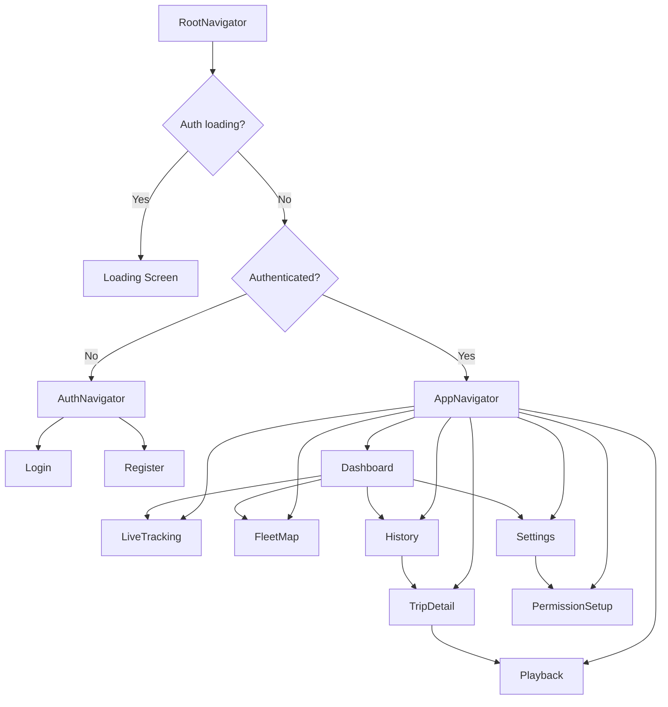

### 22.2 Architecture Diagram

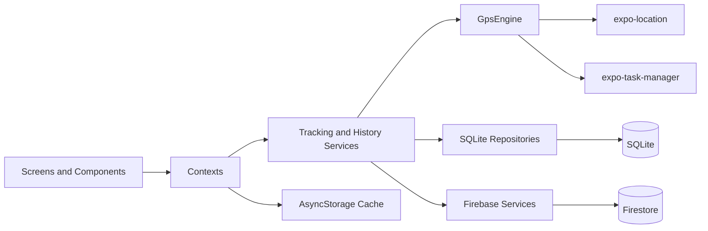

### 22.3 Database Diagram

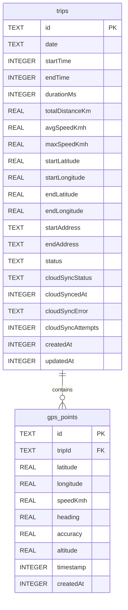

### 22.4 Firestore Diagram

```mermaid
flowchart TD
  Users[users/{uid}] --> Devices[devices/{deviceId}]
  Devices --> Live[liveLocation/current]
  Devices --> Summaries[tripSummaries/{tripId}]
  Summaries --> Chunks[gpsChunks/{chunkId}]
```

### 22.5 Tracking State Diagram

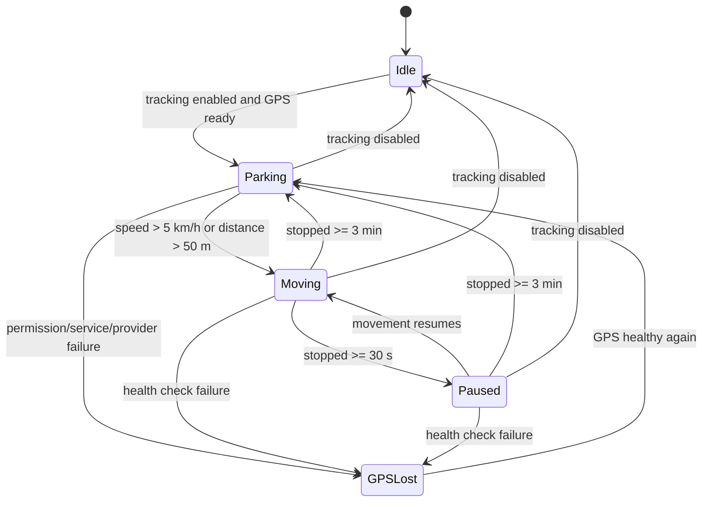

### 22.6 Permission Flow

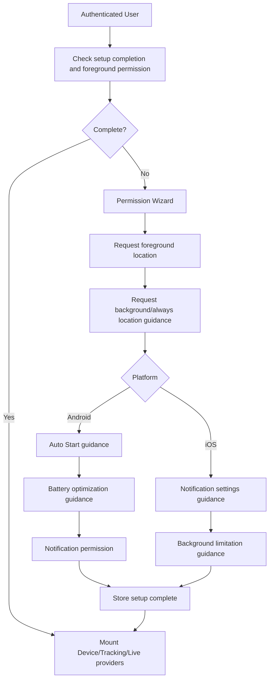

### 22.7 Sync Flow

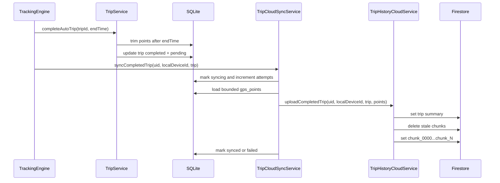

### 22.8 Playback Flow

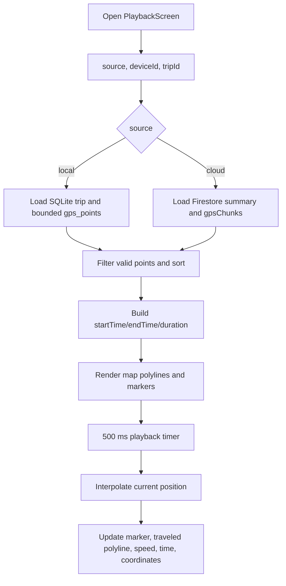

### 22.9 Offline Flow

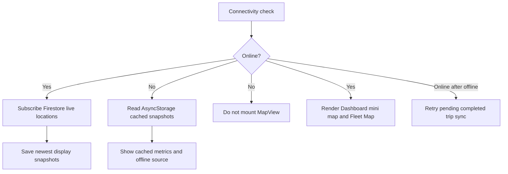

### 22.10 ADR Summary

| ADR | Decision |
| --- | --- |
| ADR-001 | SQLite is source of truth for GPS points. |
| ADR-002 | Firestore stores user/device/live location and lightweight trip history. |
| ADR-003 | MVP 1 excludes camera, dashcam, video, FFmpeg, AI. |
| ADR-004 | Future video is local-only by default. |
| ADR-005 | Local playback uses SQLite. |
| ADR-006 | Firebase liveLocation is realtime-only. |
| ADR-007 | MVP 1 targets Android first. |
| ADR-008 | Background GPS must be planned carefully with Expo/OS limits. |
| ADR-009 | MVP 1 uses auto tracking and auto trip detection with trips. |
| ADR-010 | Local tracking identity is separate from selected remote-view device. |
| ADR-011 | SQLite remains local source while completed trips sync to Firestore. |
| ADR-012 | Offline UI uses last-known display cache and shared reachability. |
| ADR-013 | Controlled project-owned visual identity replaces strict no-icon UI. |
| ADR-014 | Authentication uses Firebase Email/Password without email status gate. |
| ADR-015 | Android live tracking notification uses Expo Location foreground service. |

### 22.11 Provider Tree And Ownership Diagram

The runtime provider tree is intentionally stable. Providers must not be keyed by selected device, selected history device, timestamps, or other changing state because that can unmount tracking and interrupt local recording.

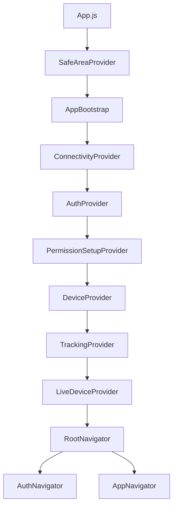

| Provider | Primary ownership | Must not own |
| --- | --- | --- |
| `AppBootstrap` | SQLite initialization before app UI uses repositories. | Auth, device, or tracking state. |
| `ConnectivityProvider` | Shared online/offline/checking state and safe rechecks. | Per-screen network polling. |
| `AuthProvider` | Firebase auth user, loading, login, register, logout. | Email verification gate. |
| `PermissionSetupProvider` | First-run setup wizard state and platform permission status. | Background tracking task implementation. |
| `DeviceProvider` | `localDeviceId`, device list, selected live device, device naming. | Trip upload ownership changes based on selected remote device. |
| `TrackingProvider` | Initializes local `TrackingEngine` for `uid + localDeviceId`. | Remote device viewing or selected history device. |
| `LiveDeviceProvider` | Firestore live subscriptions and cached remote/live display snapshots. | Local GPS recording. |

Ownership rules:

| Identity | Meaning | Can change local tracking? | Can write trip history? |
| --- | --- | --- | --- |
| `localDeviceId` | Physical device running this app install. | Yes, when authenticated user or local ownership changes. | Yes, only under its own Firestore device path. |
| `selectedDeviceId` | Device selected for Dashboard and Live Tracking viewing. | No. | No. |
| `selectedHistoryDeviceId` | Device selected on History. | No. | No. |
| Remote device ID | Another device under the same account. | No. | No from this app instance. |

### 22.12 Tracking State Contract

Tracking state is split into independent dimensions. Screens should not infer connection from movement, and should not infer movement from sync status.

| Dimension | Values | Source |
| --- | --- | --- |
| Tracking enabled | `true`, `false` | `TrackingEngine.enableTracking()` / `disableTracking()` |
| Movement status | `Idle`, `Moving`, `Paused`, `Parking`, `GPS Lost` | GPS health, speed, stop duration, and trip lifecycle |
| Connection status | `Online`, `Offline` | liveLocation publish state and shared connectivity |
| Active trip | `activeTripId`, `activeTripMaxSpeedKmh`, `currentSpeedKmh` | Local tracking runtime state |
| Stop timing | `stoppedDurationMs` | Time since last meaningful movement |

Vietnamese labels used by UI:

| Internal value | User label |
| --- | --- |
| `Idle` | Không hoạt động |
| `Moving` | Đang di chuyển |
| `Paused` | Tạm dừng |
| `Parking` | Đỗ xe |
| `GPS Lost` | Mất GPS |
| `Online` | Trực tuyến |
| `Offline` | Mất kết nối |

State transitions:

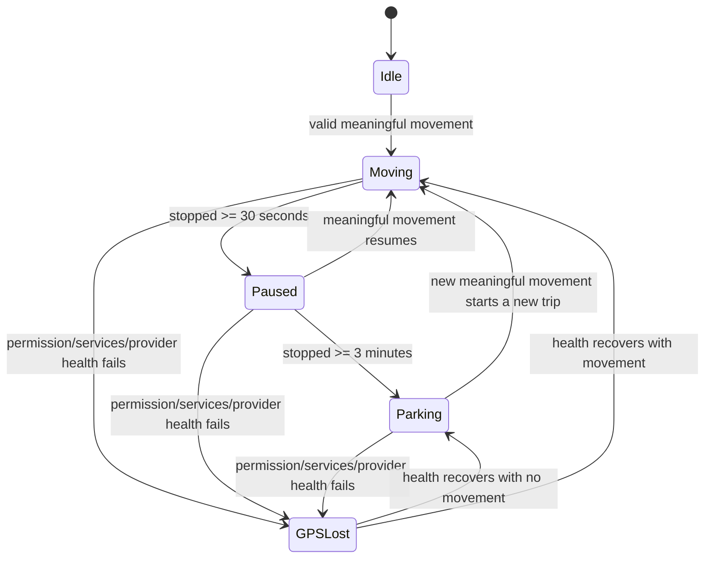

Important behavior:

| Event | Expected behavior |
| --- | --- |
| Device is stationary and watch callbacks slow down | Remain Parking or Paused if location health is okay. |
| Internet fails | Keep GPS writing locally; set connection to Mất kết nối. |
| Firestore live update fails | Keep local tracking; do not disable the engine. |
| User selects a remote device | Do not restart local tracking. |
| Trip completes after Parking | Save trip locally first, then best-effort cloud sync. |
| App is in Expo Go | Do not claim durable background tracking or Android foreground-service acceptance. |

### 22.13 Connectivity And Cache Constants

The app uses a shared reachability model rather than independent per-screen checks.

| Constant | Value | Purpose |
| --- | --- | --- |
| `INTERNET_CHECK_URL` | `https://www.gstatic.com/generate_204` | Lightweight connectivity probe. |
| `INTERNET_CHECK_TIMEOUT_MS` | `5000` | Avoid hanging UI on reachability checks. |
| `INTERNET_RECHECK_INTERVAL_MS` | `30000` | Conservative recheck interval. |
| `LIVE_CACHE_WRITE_INTERVAL_MS` | `5000` | Avoid excessive AsyncStorage writes. |
| `REMOTE_DEVICE_OFFLINE_TIMEOUT_MS` | `60000` | Marks stale remote live snapshots as disconnected. |

Connectivity state:

| State | Meaning | UI behavior |
| --- | --- | --- |
| `checking` | The app is verifying reachability. | Show non-blocking loading where needed. |
| `online` | Network is considered available. | Firestore subscriptions and maps may run. |
| `offline` | Network is unavailable or timed out. | Use cached display data; do not mount MapView for remote maps. |

Cache priority:

1. Use fresh local tracking state for the physical device.
2. Use fresh Firestore live snapshot when online.
3. Use AsyncStorage last-known snapshot when offline or stale.
4. Use user-facing empty states if no valid cache exists.

The cache is display-only. It never becomes the authoritative source for trip history, GPS points, or ownership.

### 22.14 Timestamp Normalization Rules

Track Device receives timestamps from Expo Location, SQLite rows, Firestore documents, Firestore Timestamp objects, JavaScript `Date` objects, ISO strings, and numeric strings. Shared helpers prevent screens and services from duplicating timestamp parsing.

| Helper | Purpose |
| --- | --- |
| `timestampToMillis(value)` | Converts Firestore Timestamp, `Date`, number, numeric string, or ISO string into finite epoch milliseconds where possible. |
| `getLatestTimestampMs(...values)` | Returns the latest finite timestamp across several candidates. |
| `normalizeLocationTimestamp(value, fallback)` | Converts Expo location timestamps and obvious second-scale epoch numbers into milliseconds. |

Rules:

| Input pattern | Result |
| --- | --- |
| Firestore Timestamp with `toMillis()` | Use `toMillis()`. |
| Firestore-like `{ seconds, nanoseconds }` | Convert to milliseconds. |
| JavaScript `Date` | Use `getTime()`. |
| Epoch milliseconds | Use as-is. |
| Obvious epoch seconds | Convert to milliseconds. |
| ISO string | Parse with `Date.parse`. |
| Invalid value | Return `null` or fallback, never `NaN` in UI. |

Why this matters:

- GPS spike filtering depends on monotonic millisecond timestamps.
- Playback interpolation depends on consistent start, end, and point timestamps.
- Remote online/offline freshness depends on `updatedAt` normalization.
- History screens must not crash on older or malformed data.

### 22.15 GPS Validation And Historical Repair Details

Live GPS filtering protects new data. Historical repair protects old data that may have been recorded before filters existed.

Live rejection criteria:

| Reason | Meaning |
| --- | --- |
| `invalid_coordinates` | Latitude/longitude is missing, non-finite, or outside valid bounds. |
| `non_increasing_timestamp` | New timestamp is not greater than the previous accepted point. |
| `interval_too_short` | Elapsed time is below `MIN_VALID_POINT_INTERVAL_MS`. |
| `poor_accuracy` | Finite accuracy is worse than `MAX_ACCEPTABLE_ACCURACY_METERS`. |
| `impossible_jump` | Large distance and extreme raw speed indicate a teleport-like point. |
| `pending_high_speed_confirmation` | A high-speed candidate is held until enough consistent samples arrive. |
| `inconsistent_high_speed_candidate` | Pending high-speed samples did not remain consistent. |

Rejected points do not:

- update current speed;
- update max speed;
- update previous accepted point;
- enter SQLite;
- affect trip distance;
- affect playback;
- update canonical Firestore liveLocation;
- trigger Moving status.

Historical repair:

| Step | Behavior |
| --- | --- |
| Load trip | Use bounded points between `trip.startTime` and `trip.endTime`. |
| Filter points | Apply coordinate, timestamp, interval, accuracy, jump, and speed sanity checks. |
| Recalculate stats | Rebuild distance, average speed, max speed, duration, and endpoints from accepted points. |
| Persist if needed | Update SQLite only when repaired values differ and reliable points exist. |
| Insufficient data | Do not invent values; UI can show "Chưa có dữ liệu". |

This repair is idempotent and isolated from live tracking. It does not clamp legitimate stored speeds; it removes corrupted point effects when a reliable recalculation is possible.

### 22.16 Shared UI Component Contracts

Reusable UI components keep screens consistent and beginner-friendly.

| Component | Responsibility | Notes |
| --- | --- | --- |
| `AppHeader` | Screen title and optional subtitle. | Text-based, no navigation icon assumption. |
| `PrimaryButton` | Main action button. | Supports loading label and disabled state. |
| `SecondaryButton` | Secondary action button. | Used for retry, setup, and navigation actions. |
| `DangerButton` | Destructive action such as logout. | Should remain clearly text-labeled. |
| `SurfaceCard` | Generic card surface. | Uses shared radius/shadow tokens. |
| `MetricCard` | Compact metric display. | Supports optional controlled custom icon. |
| `InfoRow` | Label/value rows. | Values must wrap safely for long IDs and coordinates. |
| `StatusBadge` | Text badge with optional code-drawn dot. | State is never conveyed only by color. |
| `EmptyState` | Empty/error/offline state. | Uses text plus optional project-owned illustration. |
| `SectionLabel` | Small section heading. | Keeps screen hierarchy consistent. |
| `TrackIcon` | Project-owned functional icon renderer. | No external icon library. |
| `BrandMark` | Logo/wordmark rendering. | Uses project-owned branding assets. |
| `EmptyStateIllustration` | Reusable illustrations. | Offline, no devices, no history, no map, no coordinates, sync failed, permission missing. |
| `DeviceMapMarker` | Code-drawn map marker. | Avoids native pins and remote-data flicker. |
| `MapErrorBoundary` | Prevents map rendering failures from crashing whole screens. | Used around map-heavy views. |

UI safety rules:

- Do not use emoji as icons.
- Do not use decorative Unicode symbols.
- Do not import external icon packages.
- Do not use native Google Maps pins.
- Important actions must have written Vietnamese labels.
- Tappable icon-like controls require `accessibilityRole`, `accessibilityLabel`, and adequate hit targets.
- Scroll screens apply bottom inset once.
- Map screens respect safe areas without creating opaque bottom blockers.

### 22.17 Branding Asset Inventory

Branding and UI assets are project-owned and should remain independent of third-party brands.

| Asset group | Location | Purpose |
| --- | --- | --- |
| Master vector logo | `src/assets/branding/track-device-master.svg` | Source of truth for brand symbol. |
| Symbol logo | `src/assets/branding/track-device-symbol.svg` | Icon-only brand use. |
| Horizontal logo | `src/assets/branding/track-device-horizontal.svg` | Wordmark use. |
| Monochrome variants | `src/assets/branding/track-device-mono-dark.svg`, `track-device-mono-light.svg` | Dark/light single-color rendering. |
| App icon | `src/assets/branding/app-icon.png` | Expo launcher icon. |
| Adaptive foreground | `src/assets/branding/adaptive-icon-foreground.png` | Android adaptive icon foreground. |
| Adaptive background | `src/assets/branding/adaptive-icon-background.png` | Android adaptive icon background. |
| Monochrome adaptive | `src/assets/branding/adaptive-icon-monochrome.png` | Android monochrome icon where supported. |
| Splash logo | `src/assets/branding/splash-logo.png` | Startup branding. |
| Favicon | `src/assets/branding/favicon.png` | Web/documentation small icon. |
| Empty-state illustrations | `src/assets/illustrations/*.png` | Offline, no devices, no history, map unavailable, no coordinates, sync failed, permission missing. |

Brand concept:

- The final identity combines a device rectangle, location/map point, signal/network arcs, and route motion.
- It avoids a car, camera, eye, or copied map-pin brand motif.
- It can scale down for launcher icons and map markers.
- It remains suitable for many tracked device types, not only vehicles.

### 22.18 Route Contracts

Navigation uses route constants rather than string literals where practical.

| Navigator area | Route | Purpose | Key params |
| --- | --- | --- | --- |
| Root | Auth stack | Unauthenticated screens. | None |
| Root | App stack | Authenticated app. | None |
| Auth | Login | Email/password login. | None |
| Auth | Register | Email/password registration with confirm password. | None |
| App | Dashboard/Home | Authenticated landing screen. | None |
| App | LiveTracking | Local or selected remote live detail. | Usually selected through `DeviceContext`; params optional. |
| App | FleetMap | Multi-device map. | None |
| App | History | Local/remote history selector and date grouping. | None |
| App | TripDetail | Trip metadata and GPS preview. | `tripId`, `deviceId`, `source` |
| App | Playback | Route playback map. | `tripId`, `deviceId`, `source` |
| App | Settings | Device name, permissions, setup wizard, logout. | None |

Source contract:

```js
{
  tripId: 'trip_xxx',
  deviceId: 'local-or-remote-device-id',
  source: 'local' // or 'cloud'
}
```

Rules:

- Local pending trips must navigate with `source: 'local'`.
- Cloud sync status must not decide playback source.
- Remote trips must navigate with `source: 'cloud'`.
- Playback must not infer source from the currently selected device after navigation.

### 22.19 Notification Flow Diagram

Android live tracking notification is tied to Expo Location foreground-service behavior.

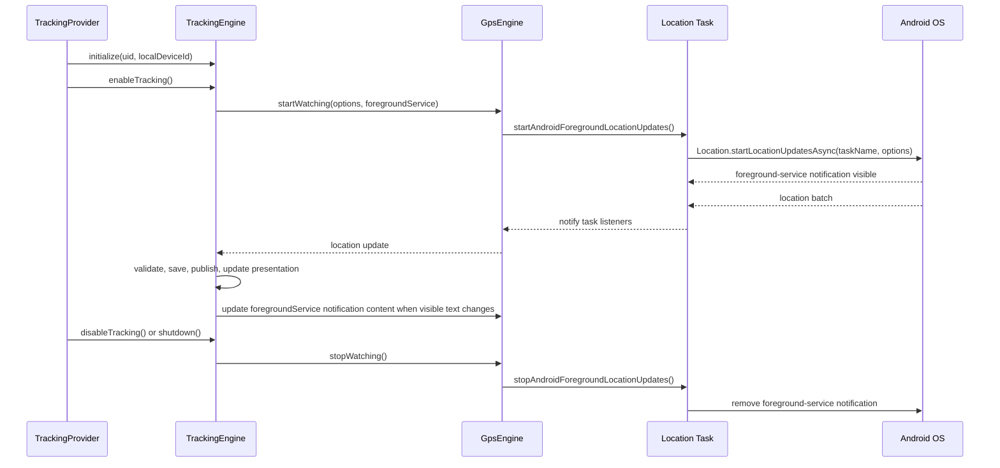

Notification content:

| Case | Title | Body |
| --- | --- | --- |
| Online | `Track Device - {deviceName}` | `{speed} km/h | Trực tuyến | {movementStatus}` |
| Disconnected | `Track Device - {deviceName}` | `Tốc độ gần nhất {speed} km/h | Mất kết nối | {movementStatus}` |

Limitations:

- Expo Location manages the foreground-service notification internally.
- The app configures title/body through foregroundService options.
- Exact channel behavior and press routing are limited by Expo/Android behavior.
- Direct navigation from notification press to Live Tracking is not implemented.
- Real acceptance requires Android Development Build or EAS APK.

### 22.20 Permission Setup Platform Matrix

| Capability | Android | iOS | Expo Go limitation |
| --- | --- | --- | --- |
| Foreground location | Requested with Expo Location. | Requested with Expo Location. | Supported, but device behavior may differ. |
| Background/always location | Requested after foreground permission. | Requested after foreground permission. | Background tracking not accepted in Expo Go. |
| Auto Start | Guidance only, Android vendor-specific. | Not shown. | Cannot be enabled programmatically. |
| Battery optimization | Guidance/settings action where possible. | Not shown. | Cannot guarantee exemption. |
| Notification permission | Android 13+ request. | iOS notification permission flow retained. | Local behavior depends on Expo Go and OS settings. |
| Background tracking task | Not fully accepted for durable tracking. | Not implemented. | Development build/APK required for acceptance. |

Device naming order:

1. `Device.deviceName` when non-empty.
2. `Device.modelName` when non-empty.
3. `Thiết bị iOS` when `Platform.OS === 'ios'`.
4. `Thiết bị Android` when `Platform.OS === 'android'`.
5. `Thiết bị`.

The platform authority is `Platform.OS`, not `Device.osName`. Existing local records with clearly wrong generic names can be repaired for the local device only. Remote devices are not renamed automatically.

### 22.21 Runtime Acceptance Checklist

This checklist is for manual validation because this export does not run the app.

Authentication:

- Register with email, password, confirm password.
- Login with an unverified Firebase email/password account.
- Logout returns to AuthNavigator.
- No email verification screen or gate appears.

Device setup:

- First authenticated run creates or restores stable `localDeviceId`.
- iOS Expo Go is never labeled Android Device.
- Custom device names are preserved.
- Remote device names are not automatically overwritten.

Tracking:

- Tracking initializes once for stable `uid + localDeviceId`.
- Speed updates from coordinate/timestamp movement.
- Stationary device becomes Paused then Parking without false GPS Lost.
- Parking completes the active trip after 3 minutes and trims confirmation tail.
- Firestore failure does not stop local SQLite tracking.

Offline:

- Dashboard keeps cached counts and selected-device metrics.
- Map screens avoid mounting MapView while offline.
- Source label becomes "Dữ liệu ngoại tuyến".
- Pending trips remain visible with full local details.

Sync:

- Manual sync updates UI immediately.
- Offline manual sync shows a clear message.
- Reconnect triggers a guarded pending-trip retry.
- Remote history reads Firestore summaries only until playback opens.

Playback:

- Local pending trip opens SQLite playback.
- Cloud playback loads chunks only when opened.
- Empty or one-point routes show readable states.
- Controls show elapsed and total time.

Notification:

- Android Development Build/APK shows one ongoing foreground-service notification while tracking.
- Notification displays local device name, rounded speed, connection, and movement status.
- Stopping tracking or logout removes it.
- iOS does not imitate Android persistent notification.

UI:

- No bottom obstruction covers final content.
- Back text calls `navigation.goBack()` when possible.
- Important statuses are Vietnamese.
- Technical terms such as SQLite, Firebase, Firestore paths, and Local Device ID are not visible in normal UI.

### 22.22 Source File Map By Subsystem

| Subsystem | Key files | What to inspect first |
| --- | --- | --- |
| App bootstrap | `App.js`, `src/contexts/InitializationContext.js` | Provider order and SQLite initialization. |
| Auth | `src/contexts/AuthContext.js`, `src/services/firebase/authService.js`, `src/services/firebase/userService.js` | Email/password flow and user profile creation. |
| Device lifecycle | `src/contexts/DeviceContext.js`, `src/services/device/deviceIdentityService.js`, `src/services/device/deviceMetadataService.js`, `src/services/firebase/deviceService.js` | Local ID, platform naming, device list, Firestore path. |
| Permissions | `src/contexts/PermissionSetupContext.js`, `src/screens/settings/PermissionSetupScreen.js`, `src/services/location/locationPermissionService.js`, `src/services/device/deviceSetupService.js` | Platform wizard and setup status. |
| Connectivity | `src/contexts/ConnectivityContext.js`, `src/services/connectivity/connectivityService.js` | Online/offline/checking source. |
| Cache | `src/services/cache/liveDataCacheService.js` | Last-known display snapshots. |
| GPS location | `src/services/location/GpsEngine.js`, `src/services/location/locationTaskService.js` | Expo location watchers and foreground-service task. |
| Tracking | `src/services/tracking/TrackingEngine.js`, `src/services/tracking/trackingSessionService.js`, `src/services/tracking/tripService.js` | Auto trip detection and local persistence. |
| Sync | `src/services/tracking/tripCloudSyncService.js`, `src/services/firebase/tripHistoryCloudService.js` | Completed trip upload and retry. |
| SQLite | `src/database/database.js`, `src/database/migrations/*.js`, `src/database/repositories/*.js` | Tables, migrations, queries. |
| Firestore | `src/services/firebase/*.js` | Auth, users, devices, live location, trip summaries. |
| History | `src/screens/history/HistoryScreen.js`, `src/screens/history/TripDetailScreen.js`, `src/services/tracking/historyService.js` | Local/remote history source handling. |
| Playback | `src/screens/tracking/PlaybackScreen.js`, `src/utils/geo.js` | Local/cloud playback and interpolation. |
| Dashboard | `src/screens/main/HomeScreen.js` | Device counts, selected summary, mini map, cache behavior. |
| Fleet Map | `src/screens/tracking/FleetMapScreen.js`, `src/hooks/useFleetLiveLocations.js` | Multi-device live map and selected-device panel. |
| Live Tracking | `src/screens/tracking/LiveTrackingScreen.js` | Local/remote live detail. |
| Settings | `src/screens/settings/SettingsScreen.js` | Device name, permission setup, logout. |
| UI system | `src/theme/*`, `src/components/ui/*`, `src/components/icons/*`, `src/components/branding/*`, `src/components/map/*` | Tokens, shared controls, icons, markers. |
| Formatting | `src/utils/format.js`, `src/utils/timestamp.js`, `src/utils/date.js` | Vietnamese display formatting and time normalization. |
| Constants | `src/constants/*.js` | Routes, tracking thresholds, cache, history, connectivity, permissions. |

---

## Closing Notes

Track Device MVP 1 is a local-first automatic GPS tracker. The most important architectural rules are:

1. SQLite owns detailed local GPS history.
2. Firestore liveLocation is realtime-only.
3. Completed trip cloud history is a synchronized read model.
4. Local device ownership must never be redirected by selected viewing devices.
5. Background permission and foreground-service notification readiness do not equal fully accepted durable background tracking.
6. MVP 2 media features remain outside current scope.
